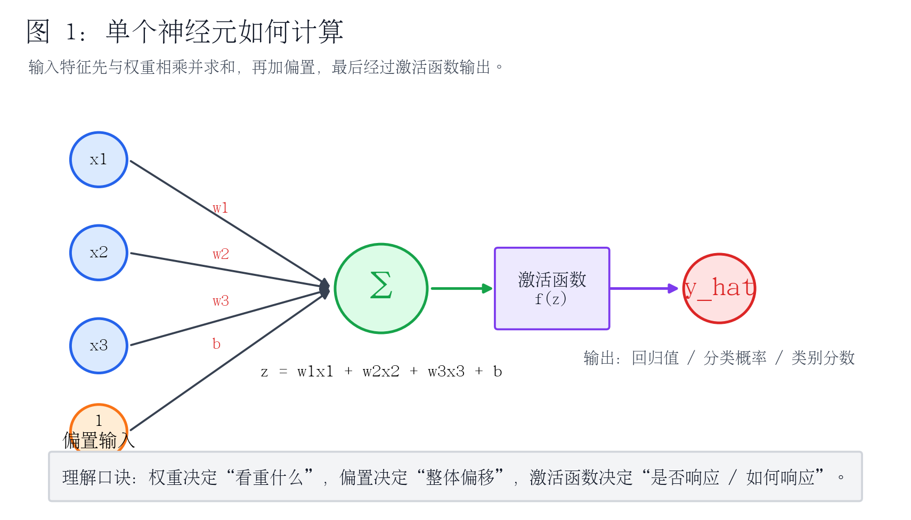
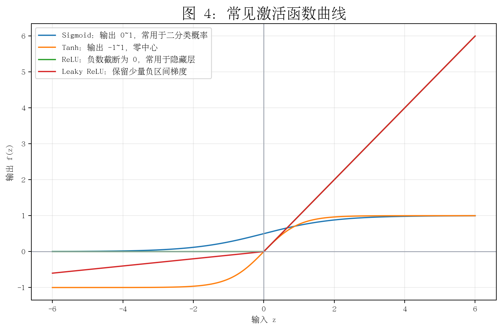
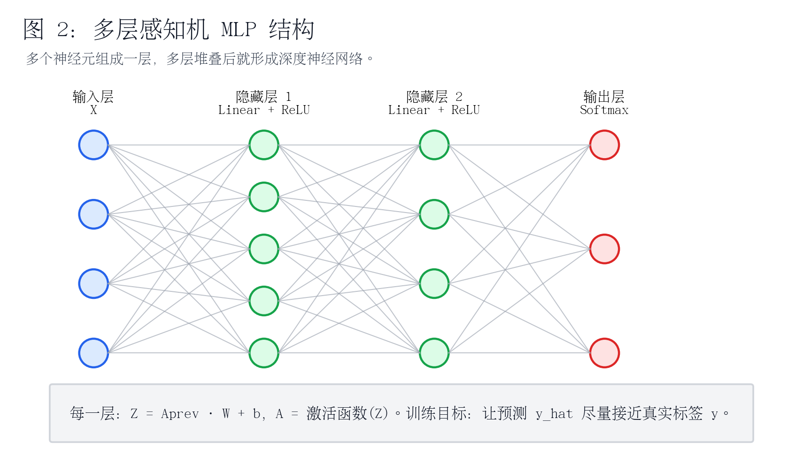
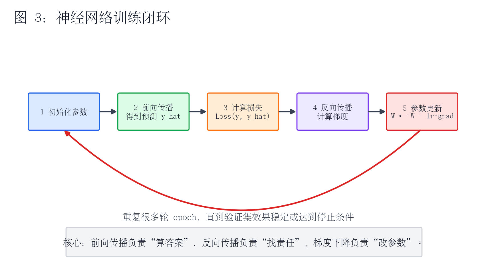
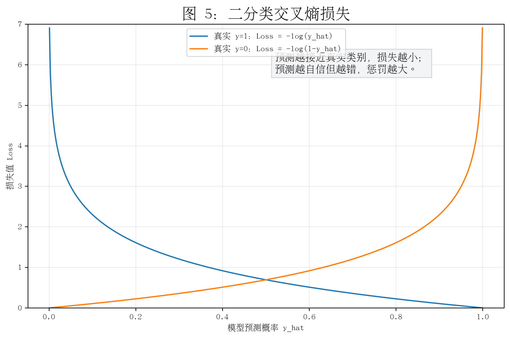
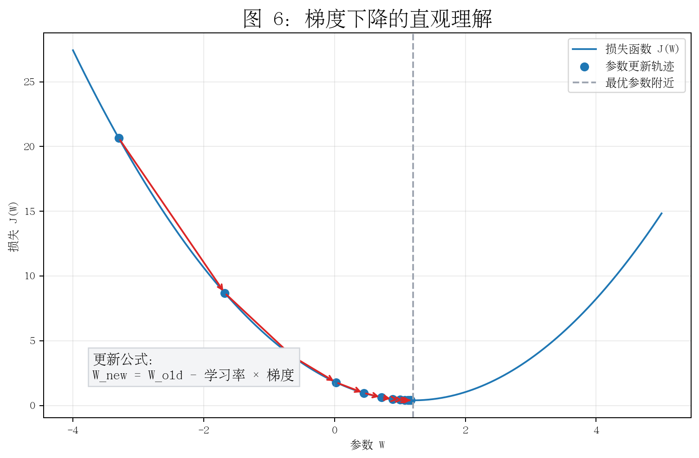
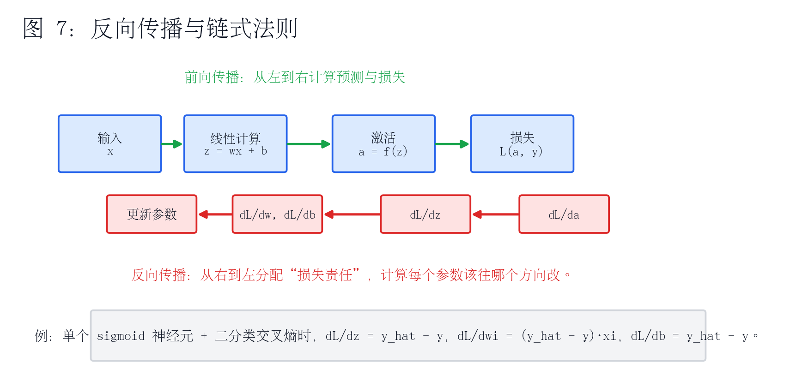
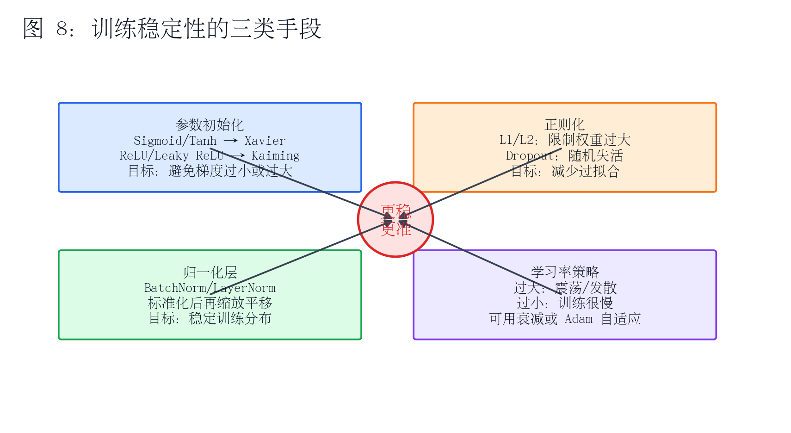

# 07 - 神经网络基础：从算法理解到训练细节

> 本章适合放在「深度学习基础」之后，目标是把“神经网络到底怎么算、怎么训练、为什么要激活函数、为什么要反向传播、为什么需要初始化和正则化”讲清楚。

---

## 0. 本章学习目标

学完本章，你应该能够回答下面这些问题：

1. 单个神经元到底在做什么计算？
2. 为什么神经网络需要激活函数？
3. 前向传播、损失函数、反向传播、梯度下降分别负责什么？
4. 二分类、多分类任务应该选择什么输出层和损失函数？
5. Xavier 初始化、Kaiming 初始化、Dropout、BatchNorm 分别解决什么问题？
6. 如何用 PyTorch 搭建一个简单的全连接神经网络？

---

## 1. 神经网络的核心思想

神经网络可以理解为：

> 用很多个“可学习的函数单元”组成一个复杂函数，让它从数据中自动学习输入和输出之间的关系。

传统机器学习里，我们经常需要手工设计特征；神经网络更强调通过多层结构自动组合特征。一个简单的全连接神经网络可以看成：

```text
输入特征 X
   ↓
线性计算：Z = XW + b
   ↓
非线性激活：A = f(Z)
   ↓
继续下一层
   ↓
输出预测结果 ŷ
```

神经网络不是“魔法”，它本质上反复做三件事：

```text
算预测 → 算误差 → 根据误差改参数
```

---

## 2. 从线性模型理解单个神经元

### 2.1 线性回归的形式

最简单的线性模型是：

```text
ŷ = w1*x1 + w2*x2 + ... + wn*xn + b
```

其中：

| 符号 | 含义 | 直观理解 |
|---|---|---|
| `x` | 输入特征 | 比如身高、体重、年龄、像素值、词向量等 |
| `w` | 权重 | 模型认为某个特征有多重要 |
| `b` | 偏置 | 整体修正值，让模型可以上下平移 |
| `ŷ` | 预测值 | 模型给出的结果 |

线性模型只能表达“直线关系”。如果真实问题很复杂，比如图片分类、文本理解、语音识别，单纯线性模型往往不够。

### 2.2 单个神经元的计算

单个神经元就是在线性计算后面加一个激活函数：

```text
z = w1*x1 + w2*x2 + ... + wn*xn + b
输出 = f(z)
```



图例说明：

- 左边的 `x1、x2、x3` 是输入特征。
- 连线上的 `w1、w2、w3` 是权重。
- `b` 是偏置。
- `Σ` 表示加权求和。
- `f(z)` 是激活函数。
- 最右边的 `y_hat` 是输出，可以是回归值、概率或类别分数。

一句话理解：

```text
权重决定“看重什么”，偏置决定“整体偏移”，激活函数决定“如何响应”。
```

---

## 3. 为什么需要激活函数？

### 3.1 没有激活函数会怎样？

假设神经网络有两层，但每层都只是线性计算：

```text
第一层：A1 = XW1 + b1
第二层：Y  = A1W2 + b2
```

把第一层代入第二层：

```text
Y = (XW1 + b1)W2 + b2
```

展开后依然是：

```text
Y = XW + b
```

也就是说：

> 多层线性变换叠加后，仍然等价于一个线性模型。

所以，如果没有激活函数，网络再深也很难表达复杂关系。

### 3.2 激活函数的作用

激活函数的作用是引入非线性，让神经网络可以拟合复杂函数。



常见激活函数：

| 激活函数 | 公式/形式 | 输出范围 | 常用位置 | 优点 | 注意点 |
|---|---|---|---|---|---|
| Sigmoid | `1 / (1 + e^(-z))` | 0 到 1 | 二分类输出层 | 可以解释为概率 | z 很大或很小时梯度很小，容易梯度消失 |
| Tanh | `(e^z - e^-z) / (e^z + e^-z)` | -1 到 1 | 早期隐藏层 | 零中心，比 Sigmoid 更适合隐藏层 | 仍可能梯度消失 |
| ReLU | `max(0, z)` | 0 到正无穷 | 隐藏层 | 计算简单，缓解梯度消失 | z<0 时梯度为 0，可能出现“死亡 ReLU” |
| Leaky ReLU | `z>0 时 z，否则 0.01z` | 负到正 | 隐藏层 | 负区间仍保留小梯度 | 需要设置负区间斜率 |
| Softmax | `exp(zi) / sum(exp(zj))` | 多个概率之和为 1 | 多分类输出层 | 输出各类别概率 | 通常配合交叉熵损失 |

### 3.3 激活函数怎么选？

实际项目中可以先这样选：

```text
隐藏层：优先 ReLU
二分类输出层：Sigmoid
多分类输出层：Softmax 或直接输出 logits 再交给 CrossEntropyLoss
回归任务输出层：通常不加激活函数，直接输出连续值
```

注意：在 PyTorch 中，多分类任务常用 `nn.CrossEntropyLoss()`，它内部已经包含 `LogSoftmax + NLLLoss` 的效果，所以模型最后一层通常直接输出 logits，不需要手动加 Softmax。

---

## 4. 多层神经网络是怎么组成的？

一个多层感知机，也叫 MLP，全称 Multilayer Perceptron，通常由输入层、隐藏层和输出层组成。



### 4.1 层的计算方式

假设输入是 `X`，第 1 层参数是 `W1、b1`：

```text
Z1 = XW1 + b1
A1 = ReLU(Z1)
```

第 2 层：

```text
Z2 = A1W2 + b2
A2 = ReLU(Z2)
```

输出层：

```text
Z3 = A2W3 + b3
```

如果是二分类：

```text
ŷ = sigmoid(Z3)
```

如果是多分类：

```text
ŷ = softmax(Z3)
```

如果是回归：

```text
ŷ = Z3
```

### 4.2 参数数量怎么算？

假设某一层：

```text
输入维度 = in_features
输出维度 = out_features
```

这一层的参数数量为：

```text
参数数量 = in_features * out_features + out_features
```

其中：

```text
in_features * out_features 是权重参数数量
out_features 是偏置参数数量
```

例如：

```text
输入维度 10，输出维度 64
参数数量 = 10 * 64 + 64 = 704
```

理解参数数量很重要，因为：

```text
参数越多 → 表达能力越强 → 也越容易过拟合 → 训练成本越高
```

---

## 5. 神经网络训练的完整流程

神经网络训练可以理解为一个循环。



训练流程：

```text
1. 初始化参数 W、b
2. 输入数据 X
3. 前向传播，得到预测值 ŷ
4. 用损失函数比较 ŷ 和真实标签 y
5. 反向传播，计算每个参数的梯度
6. 用优化器更新参数
7. 重复很多轮，直到效果稳定
```

一句话理解：

```text
前向传播负责“算答案”，损失函数负责“打分”，反向传播负责“找责任”，梯度下降负责“改参数”。
```

---

## 6. 损失函数：模型到底错了多少？

损失函数用来衡量预测值和真实值之间的差异。

```text
损失越大：模型错得越严重
损失越小：模型预测越接近真实结果
```

不同任务选择不同损失函数。

### 6.1 回归任务：均方误差 MSE

回归任务预测的是连续值，比如房价、销量、温度。

常用损失函数：

```text
MSE = 平均((真实值 - 预测值)^2)
```

特点：

```text
误差越大，平方后惩罚越重
适合连续值预测
对异常值比较敏感
```

PyTorch 示例：

```python
import torch
import torch.nn as nn

criterion = nn.MSELoss()
y_pred = torch.tensor([2.5, 3.0, 4.2])
y_true = torch.tensor([3.0, 2.8, 4.0])
loss = criterion(y_pred, y_true)
print(loss)
```

### 6.2 二分类任务：二分类交叉熵

二分类任务输出通常是一个概率：

```text
ŷ = P(y=1 | x)
```

比如：

```text
是否垃圾邮件
是否患病
是否会流失
是否点击广告
```

二分类交叉熵：

```text
Loss = -[y*log(ŷ) + (1-y)*log(1-ŷ)]
```



图例说明：

- 当真实标签 `y=1` 时，模型预测 `ŷ` 越接近 1，损失越小。
- 当真实标签 `y=0` 时，模型预测 `ŷ` 越接近 0，损失越小。
- 如果模型非常自信但预测错了，损失会非常大。

PyTorch 示例：

```python
import torch
import torch.nn as nn

criterion = nn.BCELoss()
y_pred = torch.tensor([0.8, 0.2], dtype=torch.float32)  # sigmoid 后的概率
y_true = torch.tensor([1.0, 0.0], dtype=torch.float32)
loss = criterion(y_pred, y_true)
print(loss)
```

更推荐的写法是：

```python
criterion = nn.BCEWithLogitsLoss()
```

它会把 Sigmoid 和 BCELoss 合在一起，数值更稳定。这时模型输出层不要手动加 Sigmoid。

### 6.3 多分类任务：交叉熵损失

多分类任务是在多个类别中选一个，比如：

```text
图片是猫、狗、车、飞机中的哪一类？
新闻是体育、财经、娱乐、科技中的哪一类？
```

多分类常用交叉熵损失：

```text
Loss = -log(正确类别的预测概率)
```

PyTorch 示例：

```python
import torch
import torch.nn as nn

criterion = nn.CrossEntropyLoss()

# 模型输出 logits，不需要先 softmax
logits = torch.tensor([
    [2.0, 0.5, 0.1],
    [0.2, 1.8, 0.3]
], dtype=torch.float32)

# 真实类别编号：第一个样本属于类别0，第二个样本属于类别1
labels = torch.tensor([0, 1], dtype=torch.long)

loss = criterion(logits, labels)
print(loss)
```

---

## 7. 梯度下降：参数怎么更新？

### 7.1 梯度是什么？

梯度可以理解为：

```text
损失函数在当前参数位置上，增长最快的方向。
```

如果要让损失变小，就要沿着梯度的反方向走。

参数更新公式：

```text
W_new = W_old - learning_rate * gradient
```

其中：

| 名称 | 含义 |
|---|---|
| `W_old` | 当前参数 |
| `gradient` | 当前参数位置的梯度 |
| `learning_rate` | 学习率，控制每次更新步子大小 |
| `W_new` | 更新后的参数 |



### 7.2 学习率太大或太小会怎样？

| 学习率情况 | 现象 | 结果 |
|---|---|---|
| 太大 | 更新步子太大，来回震荡 | 损失不下降，甚至发散 |
| 太小 | 更新步子太小 | 训练很慢，容易卡住 |
| 合适 | 稳定下降 | 更容易收敛 |

实际经验：

```text
Adam 优化器可以先试 1e-3
SGD 可以先试 1e-2 或 1e-3
如果 loss 震荡明显，调小学习率
如果 loss 几乎不动，可能需要调大学习率或检查模型/数据
```

---

## 8. 反向传播：模型怎么知道每个参数错在哪里？

### 8.1 前向传播和反向传播的区别

```text
前向传播：从输入到输出，计算预测值和损失。
反向传播：从损失往回推，计算每个参数对损失的影响。
```



### 8.2 链式法则的直观理解

假设有一个简单计算链：

```text
x → z → a → Loss
```

也就是：

```text
z = wx + b
a = f(z)
Loss = L(a, y)
```

如果想知道 `w` 对 Loss 的影响，就要把中间影响一层层乘起来：

```text
dLoss/dw = dLoss/da * da/dz * dz/dw
```

这就是链式法则。

### 8.3 用单个 sigmoid 神经元理解梯度

二分类场景中：

```text
z = w1*x1 + w2*x2 + ... + b
ŷ = sigmoid(z)
Loss = 二分类交叉熵(y, ŷ)
```

在这种组合下，有一个非常简洁的结果：

```text
dLoss/dz = ŷ - y
```

然后：

```text
dLoss/dw1 = (ŷ - y) * x1
dLoss/dw2 = (ŷ - y) * x2
dLoss/db  = ŷ - y
```

这说明：

```text
预测值 ŷ 比真实值 y 大 → 梯度为正 → 参数往小调
预测值 ŷ 比真实值 y 小 → 梯度为负 → 参数往大调
预测值 ŷ 接近真实值 y → 梯度接近 0 → 参数变化小
```

这就是反向传播的核心：

> 根据误差大小和输入特征，判断每个参数应该调大还是调小。

---

## 9. 优化器：梯度下降的改进版本

普通梯度下降有时会遇到问题：

```text
平缓区域：梯度很小，走得慢
鞍点：某些方向像最低点，某些方向还能下降
局部最小值：看起来已经很低，但不是全局最优
不同参数尺度差异大：有的参数更新太快，有的太慢
```

常见优化器：

| 优化器 | 核心思想 | 适合场景 |
|---|---|---|
| SGD | 按当前梯度更新 | 简单、稳定，但可能较慢 |
| Momentum | 引入“惯性”，参考过去梯度方向 | 减少震荡，加速下降 |
| AdaGrad | 每个参数有自己的学习率 | 稀疏特征场景有用，但学习率可能越来越小 |
| RMSProp | 使用梯度平方的指数移动平均调整学习率 | 适合非平稳目标，深度学习中常用 |
| Adam | Momentum + RMSProp | 默认首选，收敛快，调参相对容易 |

常用建议：

```text
入门项目：优先 Adam
想追求最终泛化效果：可以试 SGD + Momentum
训练不稳定：先降低学习率，再检查数据归一化和初始化
```

PyTorch 示例：

```python
optimizer = torch.optim.Adam(model.parameters(), lr=1e-3)
```

训练时：

```python
optimizer.zero_grad()  # 清空上一轮梯度
loss.backward()        # 反向传播计算梯度
optimizer.step()       # 更新参数
```

---

## 10. 参数初始化：为什么不能随便初始化？

### 10.1 初始化为什么重要？

如果所有权重都初始化成 0，会发生什么？

```text
同一层的神经元输入一样、参数一样、梯度也一样
每个神经元学到的东西完全相同
网络退化，无法学出多样特征
```

所以权重一般要随机初始化。

但随机也不能太随便：

```text
权重太大 → 激活值爆炸，梯度可能爆炸
权重太小 → 激活值太弱，梯度可能消失
```

### 10.2 Xavier 和 Kaiming 初始化

常用选择：

| 激活函数 | 推荐初始化 |
|---|---|
| Sigmoid / Tanh | Xavier 初始化 |
| ReLU / Leaky ReLU | Kaiming 初始化，也叫 He 初始化 |

理解方式：

```text
Xavier：尽量让每层输入输出方差保持稳定，适合 tanh/sigmoid。
Kaiming：考虑 ReLU 会截断一半负值，适合 ReLU 系列。
```

PyTorch 示例：

```python
import torch.nn as nn

layer = nn.Linear(128, 64)

# ReLU 推荐 Kaiming 初始化
nn.init.kaiming_normal_(layer.weight, nonlinearity="relu")
nn.init.zeros_(layer.bias)
```

如果使用 Tanh：

```python
nn.init.xavier_normal_(layer.weight)
nn.init.zeros_(layer.bias)
```

---

## 11. 正则化：如何减少过拟合？

### 11.1 什么是过拟合？

过拟合指的是：

```text
训练集效果很好，但测试集/新数据效果差。
```

本质是模型记住了训练数据的细节和噪声，而没有学到可泛化的规律。

### 11.2 常见正则化方法



| 方法 | 核心思想 | 作用 |
|---|---|---|
| L1 正则 | 惩罚权重绝对值 | 让部分权重变为 0，有特征选择效果 |
| L2 正则 | 惩罚权重平方 | 防止权重过大，常用 |
| Dropout | 训练时随机让部分神经元失活 | 减少神经元之间过度依赖 |
| BatchNorm | 对一批数据做标准化，再缩放平移 | 稳定训练，加速收敛 |
| Early Stopping | 验证集不再提升就停止训练 | 防止继续记忆训练集噪声 |

### 11.3 Dropout 的直观理解

Dropout 训练时会随机关闭一部分神经元：

```text
每次训练只使用网络的一个“子网络”
迫使模型不要过度依赖某几个神经元
提升泛化能力
```

注意：

```text
训练阶段：Dropout 生效
测试/推理阶段：Dropout 不生效
```

PyTorch 示例：

```python
self.net = nn.Sequential(
    nn.Linear(20, 64),
    nn.ReLU(),
    nn.Dropout(p=0.3),
    nn.Linear(64, 2)
)
```

### 11.4 BatchNorm 的直观理解

BatchNorm 做两件事：

```text
1. 标准化：让一批数据的分布更稳定
2. 重构：通过可学习参数 gamma 和 beta 恢复表达能力
```

简化理解：

```text
先把数据拉回稳定范围，再让模型自己决定缩放和平移。
```

PyTorch 示例：

```python
self.net = nn.Sequential(
    nn.Linear(20, 64),
    nn.BatchNorm1d(64),
    nn.ReLU(),
    nn.Linear(64, 2)
)
```

---

## 12. 输出层、激活函数、损失函数如何搭配？

这是初学者最容易混淆的地方。

| 任务类型 | 输出层维度 | 最后一层激活 | 损失函数 | 标签格式 |
|---|---:|---|---|---|
| 回归 | 1 或多个连续值 | 通常不加 | `MSELoss` / `L1Loss` | float |
| 二分类 | 1 | Sigmoid | `BCELoss` | float，0/1 |
| 二分类推荐 | 1 | 不加 Sigmoid | `BCEWithLogitsLoss` | float，0/1 |
| 多分类 | 类别数 C | 不加 Softmax | `CrossEntropyLoss` | long，类别编号 |
| 多标签分类 | 标签数 K | 不加 Sigmoid | `BCEWithLogitsLoss` | float，多维 0/1 |

重点记忆：

```text
CrossEntropyLoss：模型输出 logits，标签是类别编号，不要手动 softmax。
BCEWithLogitsLoss：模型输出 logits，标签是 0/1，不要手动 sigmoid。
```

---

## 13. PyTorch 完整示例：搭建一个分类神经网络

下面是一个二分类/多分类都可以改造的 MLP 模板。

### 13.1 模型定义

```python
import torch
import torch.nn as nn

class MLPClassifier(nn.Module):
    def __init__(self, input_dim: int, hidden_dim: int, num_classes: int):
        super().__init__()

        self.net = nn.Sequential(
            nn.Linear(input_dim, hidden_dim),
            nn.BatchNorm1d(hidden_dim),
            nn.ReLU(),
            nn.Dropout(p=0.3),

            nn.Linear(hidden_dim, hidden_dim),
            nn.ReLU(),

            nn.Linear(hidden_dim, num_classes)
        )

        self._init_weights()

    def _init_weights(self):
        for layer in self.modules():
            if isinstance(layer, nn.Linear):
                nn.init.kaiming_normal_(layer.weight, nonlinearity="relu")
                nn.init.zeros_(layer.bias)

    def forward(self, x):
        return self.net(x)
```

### 13.2 多分类训练示例

```python
model = MLPClassifier(input_dim=20, hidden_dim=64, num_classes=3)
criterion = nn.CrossEntropyLoss()
optimizer = torch.optim.Adam(model.parameters(), lr=1e-3)

for epoch in range(10):
    model.train()

    # 假设 X_batch: [batch_size, 20]
    # 假设 y_batch: [batch_size]，取值为 0/1/2
    logits = model(X_batch)
    loss = criterion(logits, y_batch)

    optimizer.zero_grad()
    loss.backward()
    optimizer.step()

    print(f"epoch={epoch}, loss={loss.item():.4f}")
```

### 13.3 二分类训练示例

如果是二分类，输出层可以改为 1：

```python
model = MLPClassifier(input_dim=20, hidden_dim=64, num_classes=1)
criterion = nn.BCEWithLogitsLoss()
optimizer = torch.optim.Adam(model.parameters(), lr=1e-3)

logits = model(X_batch).squeeze(1)   # [batch_size]
loss = criterion(logits, y_batch.float())
```

预测概率时再手动 Sigmoid：

```python
prob = torch.sigmoid(logits)
pred = (prob >= 0.5).long()
```

---

## 14. 常见问题排查

### 14.1 Loss 不下降

可能原因：

```text
学习率太大或太小
标签格式不对
输出层和损失函数搭配错误
数据没有归一化
模型太简单或太复杂
梯度没有清零 optimizer.zero_grad()
忘记 loss.backward()
忘记 optimizer.step()
```

### 14.2 训练集很好，测试集很差

这通常是过拟合。

可以尝试：

```text
增加数据量
增加 Dropout
使用 L2 正则，也就是 weight_decay
减小模型规模
使用 Early Stopping
做数据增强
```

PyTorch 中 L2 正则常用写法：

```python
optimizer = torch.optim.Adam(model.parameters(), lr=1e-3, weight_decay=1e-4)
```

### 14.3 准确率一直随机猜

可能原因：

```text
标签和样本没有对齐
类别编号不从 0 开始
CrossEntropyLoss 前手动加了 Softmax
二分类用了 BCELoss 但模型输出不是概率
数据特征没有有效信息
学习率不合适
```

---

## 15. 本章总结

### 15.1 一句话总结

```text
神经网络 = 多层“线性计算 + 非线性激活”的组合，通过损失函数衡量错误，再用反向传播和梯度下降不断更新参数。
```

### 15.2 核心概念表

| 概念 | 作用 | 记忆方式 |
|---|---|---|
| 权重 W | 控制特征重要性 | 看重什么 |
| 偏置 b | 修正整体偏移 | 整体平移 |
| 激活函数 | 引入非线性 | 让模型有反应 |
| 前向传播 | 计算预测值 | 算答案 |
| 损失函数 | 衡量预测错误 | 打分 |
| 反向传播 | 计算梯度 | 找责任 |
| 梯度下降 | 更新参数 | 改参数 |
| 初始化 | 让训练一开始更稳定 | 起点要合理 |
| Dropout | 减少过拟合 | 随机失活 |
| BatchNorm | 稳定中间层分布 | 标准化再重构 |

### 15.3 推荐学习顺序

```text
1. 先理解单个神经元：z = wx + b，a = f(z)
2. 再理解多层网络：一层一层做同样的事
3. 再理解训练闭环：前向传播 → 损失 → 反向传播 → 更新
4. 再学习损失函数：MSE、BCE、CrossEntropy
5. 再学习训练技巧：初始化、学习率、优化器、正则化
6. 最后用 PyTorch 写一个完整训练流程
```

---

## 16. 课后练习

### 练习 1：手算单个神经元输出

已知：

```text
x1 = 2, x2 = 3
w1 = 0.5, w2 = -1
b = 1
激活函数使用 sigmoid
```

请计算：

```text
z = ?
sigmoid(z) = ?
```

### 练习 2：判断任务搭配

请判断下面任务应该用什么输出层和损失函数：

```text
1. 预测房价
2. 判断邮件是否垃圾邮件
3. 判断图片是猫、狗、车三类中的哪一类
4. 一篇文章可能同时属于“科技”“财经”“AI”多个标签
```

### 练习 3：写一个最小训练循环

要求：

```text
1. 定义一个两层 MLP
2. 使用 CrossEntropyLoss
3. 使用 Adam 优化器
4. 写出 zero_grad、backward、step 三步
```

---

## 17. 本章配图清单

| 图 | 文件 |
|---|---|
| 单个神经元如何计算 | `assets/images/nn-neuron.png` |
| 多层感知机结构 | `assets/images/nn-mlp-architecture.png` |
| 神经网络训练闭环 | `assets/images/nn-training-loop.png` |
| 常见激活函数曲线 | `assets/images/nn-activation-functions.png` |
| 二分类交叉熵损失 | `assets/images/nn-bce-loss.png` |
| 梯度下降直观理解 | `assets/images/nn-gradient-descent.png` |
| 反向传播与链式法则 | `assets/images/nn-backprop-chain-rule.png` |
| 训练稳定性方法 | `assets/images/nn-training-stability.png` |
