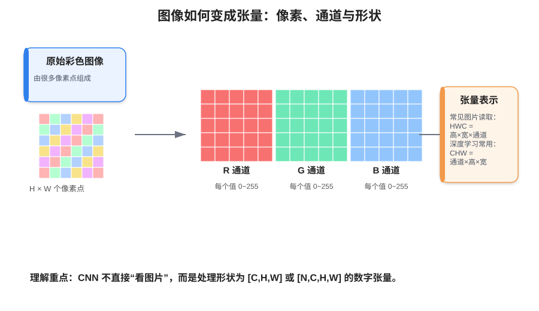
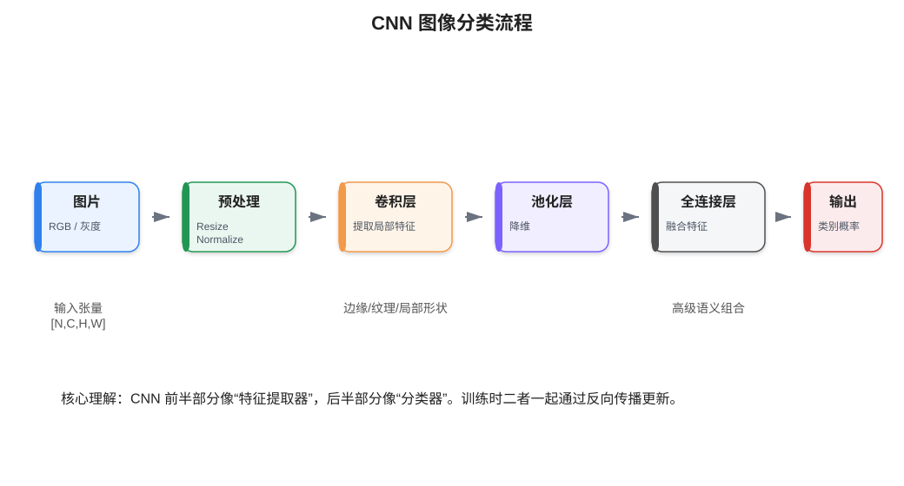
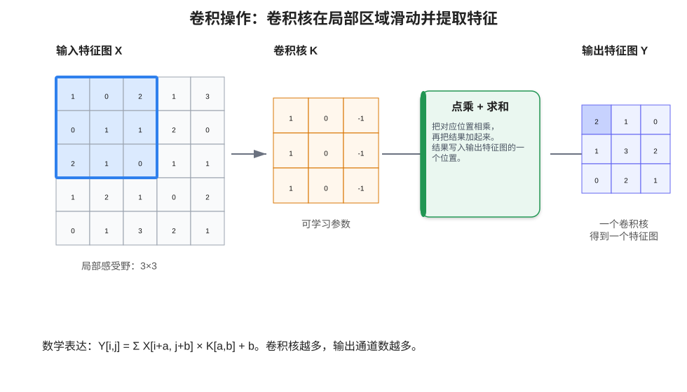
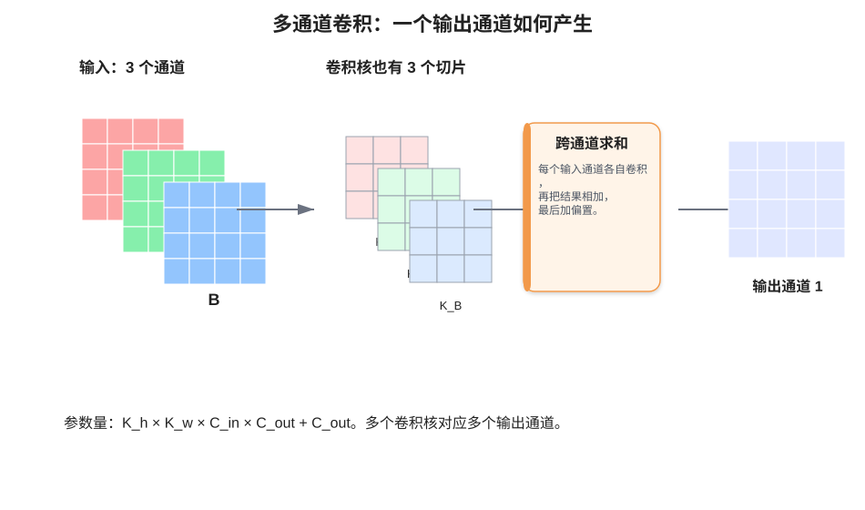
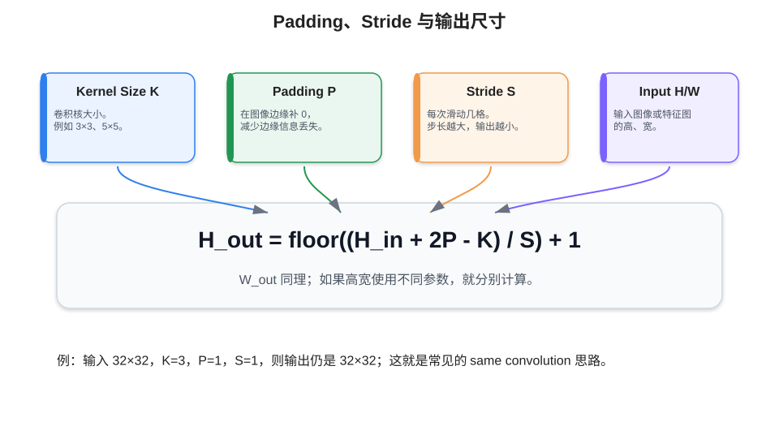
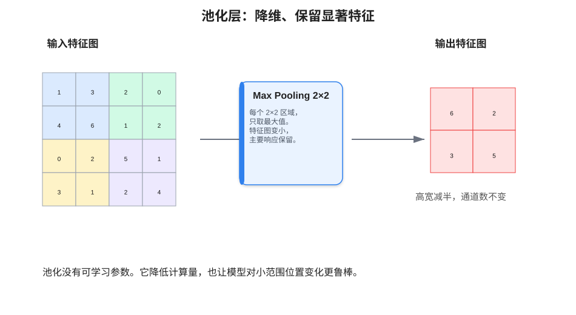
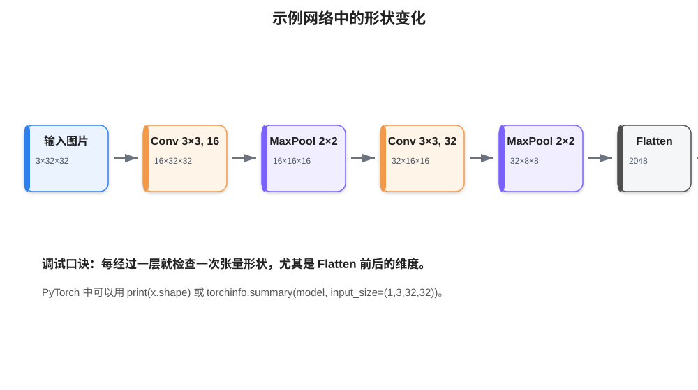

# 08 - 卷积神经网络 CNN 细化版

> 本章目标：理解图像如何变成张量，理解卷积层、池化层、全连接层分别在 CNN 中做什么，掌握卷积输出尺寸、参数量、训练流程和一个完整 PyTorch 图像分类案例。

---

## 0. 本章学习路径

建议按下面顺序学习：

1. 先理解图像数据：像素、RGB、HWC、CHW、归一化。
2. 再理解 CNN 为什么比普通全连接网络更适合图像。
3. 重点掌握卷积层：卷积核、局部感受野、步长、填充、输出尺寸、参数量。
4. 理解池化层：为什么降维，MaxPool 和 AvgPool 有什么区别。
5. 理解完整图像分类流程：卷积提特征，池化降维，全连接输出类别。
6. 用 PyTorch 跑通一个小型 CNN，并学会检查张量形状。

---

## 1. 图像基础：图片在模型里其实是数字张量

在人的眼里，图片是一幅画；在模型眼里，图片是一个多维数组。

常见图像类型：

| 类型 | 含义 | 数值范围 | 说明 |
|---|---|---:|---|
| 二值图 | 只有黑白两种颜色 | 0 / 1 | 常用于简单掩码、二值化图像 |
| 灰度图 | 只有亮度信息 | 0 ~ 255 | 0 接近黑，255 接近白 |
| 真彩图 | RGB 三通道 | 每个通道 0 ~ 255 | 深度学习中最常见 |



### 1.1 HWC 和 CHW

很多图像库读取图片时，形状通常是：

```text
HWC = Height × Width × Channel
```

例如：

```text
(640, 640, 3)
```

含义是：

```text
高 640
宽 640
通道 3，也就是 RGB
```

但是在 PyTorch 中，卷积层 `nn.Conv2d` 默认接收的是：

```text
NCHW = Batch × Channel × Height × Width
```

例如一个 batch 里有 32 张 RGB 图片，每张是 224×224：

```text
[32, 3, 224, 224]
```

所以做图像任务时，经常会遇到维度转换：

```python
# HWC -> CHW
img = img.permute(2, 0, 1)
```

### 1.2 为什么要归一化

原始像素值通常是 `0 ~ 255`。如果直接送入神经网络，数值范围比较大，训练可能不稳定。常见做法是先缩放到 `0 ~ 1`，再做标准化：

```python
from torchvision import transforms

transform = transforms.Compose([
    transforms.ToTensor(),  # 把 [0,255] 转成 [0,1]，并把 HWC 转成 CHW
    transforms.Normalize(mean=(0.5, 0.5, 0.5), std=(0.5, 0.5, 0.5))
])
```

经过上面处理后，像素大致会被缩放到 `-1 ~ 1` 附近。

---

## 2. 为什么图像任务更适合 CNN

假设一张图片大小是 `224 × 224 × 3`，如果直接拉平成一维向量：

```text
224 × 224 × 3 = 150528
```

如果第一个全连接层有 1000 个神经元，那么参数量大约是：

```text
150528 × 1000 = 150,528,000
```

这还只是第一层，参数量非常大。而且全连接层会破坏图像的空间结构，比如左上角像素和右下角像素在拉平后只是向量里的两个数字，模型不容易理解“局部相邻关系”。

CNN 的优势主要来自三点：

| 思想 | 含义 | 好处 |
|---|---|---|
| 局部连接 | 每个卷积核只看图片的一小块区域 | 更符合图像局部特征规律 |
| 权重共享 | 同一个卷积核在整张图上滑动 | 参数量大幅减少 |
| 层级特征 | 浅层提取边缘，深层组合成部件和物体 | 适合图像识别 |

可以把 CNN 理解成：

```text
用一组可学习的小窗口，在图片上不断扫描，自动找出有用特征。
```

---

## 3. CNN 的整体结构

一个基础 CNN 通常由三类层组成：

| 层 | 作用 | 类比 |
|---|---|---|
| 卷积层 Convolution | 提取局部特征 | 找边缘、纹理、形状 |
| 池化层 Pooling | 降低特征图大小 | 保留主要信息，减少计算 |
| 全连接层 Fully Connected | 输出分类或回归结果 | 根据特征做最终判断 |



常见结构如下：

```text
输入图片
→ Conv
→ ReLU
→ Pool
→ Conv
→ ReLU
→ Pool
→ Flatten
→ Linear
→ Softmax / CrossEntropy
```

注意：PyTorch 中做多分类任务时，一般不需要手动写 `Softmax`，因为 `nn.CrossEntropyLoss()` 内部已经包含了 `LogSoftmax + NLLLoss` 的逻辑。

---

## 4. 卷积层：CNN 的核心

### 4.1 单通道卷积怎么计算

卷积层中最重要的概念是 **卷积核 kernel/filter**。卷积核可以理解成一个小矩阵，比如 `3×3`。它会在输入图像或特征图上滑动，每到一个位置，就和当前位置覆盖的小区域做“对应元素相乘再求和”。



如果输入是 `X`，卷积核是 `K`，输出是 `Y`，那么可以写成：

```text
Y[i, j] = sum( X[i+a, j+b] * K[a, b] ) + bias
```

更直观地说：

```text
卷积核看一小块区域
→ 计算这一小块区域和卷积核的匹配程度
→ 得到输出特征图上的一个值
```

如果某个卷积核学会了检测“竖直边缘”，那么它在图片中遇到竖直边缘时输出值会比较大；如果没有遇到，输出值会比较小。

### 4.2 多通道卷积怎么计算

彩色图片不是单通道，而是 RGB 三通道。对 RGB 图片做卷积时，一个卷积核也要有三个通道切片。

例如输入是：

```text
C_in = 3
H = 32
W = 32
```

一个 `3×3` 卷积核实际参数形状是：

```text
3 × 3 × 3
```

也就是：

```text
R 通道一个 3×3
G 通道一个 3×3
B 通道一个 3×3
```

每个通道分别卷积，然后把结果加起来，再加上偏置，得到一个输出特征图。



如果有 16 个卷积核，就会得到 16 个输出特征图，也就是输出通道数为 16。

### 4.3 Conv2d 参数解释

PyTorch 中常用：

```python
nn.Conv2d(
    in_channels=3,
    out_channels=16,
    kernel_size=3,
    stride=1,
    padding=1
)
```

每个参数的含义：

| 参数 | 含义 | 例子 |
|---|---|---|
| `in_channels` | 输入通道数 | RGB 图片是 3 |
| `out_channels` | 输出通道数，也就是卷积核数量 | 16 表示 16 个卷积核 |
| `kernel_size` | 卷积核大小 | 3 表示 3×3 |
| `stride` | 滑动步长 | 1 表示每次移动 1 格 |
| `padding` | 边缘填充 | 1 表示四周补 1 圈 0 |

### 4.4 输出尺寸计算公式

卷积后的高宽不是随便变的，可以计算：

```text
H_out = floor((H_in + 2P - K) / S) + 1
W_out = floor((W_in + 2P - K) / S) + 1
```

其中：

```text
H_in / W_in = 输入高宽
K = 卷积核大小
P = padding
S = stride
```



例子：输入是 `32×32`，使用 `kernel_size=3`、`padding=1`、`stride=1`：

```text
H_out = floor((32 + 2×1 - 3) / 1) + 1
      = floor(31) + 1
      = 32
```

所以输出仍然是 `32×32`。

这就是为什么很多 CNN 中会用：

```python
nn.Conv2d(3, 16, kernel_size=3, padding=1)
```

它可以在提取特征的同时保持特征图高宽不变。

### 4.5 卷积层参数量计算

卷积层参数量公式：

```text
参数量 = kernel_h × kernel_w × in_channels × out_channels + out_channels
```

最后的 `out_channels` 是偏置项数量。

例子：

```python
nn.Conv2d(3, 16, kernel_size=3)
```

参数量是：

```text
3 × 3 × 3 × 16 + 16 = 448
```

相比动辄上亿参数的全连接层，卷积层参数量小很多。

---

## 5. 池化层：降低空间尺寸

池化层通常接在卷积层后面，用来降低特征图的高和宽。

最常见的是 `MaxPool2d`：

```python
nn.MaxPool2d(kernel_size=2, stride=2)
```

含义是：

```text
每个 2×2 区域取最大值
高宽都减半
通道数不变
```



举例：

```text
输入形状：[N, 16, 32, 32]
经过 MaxPool2d(2,2)
输出形状：[N, 16, 16, 16]
```

池化层的作用：

1. 减小特征图尺寸，降低计算量。
2. 保留比较显著的特征。
3. 增强模型对小范围平移的鲁棒性。

Max Pooling 和 Average Pooling 的区别：

| 池化方式 | 做法 | 适合理解 |
|---|---|---|
| MaxPool | 取局部最大值 | 保留最强响应，例如边缘、纹理 |
| AvgPool | 取局部平均值 | 平滑局部信息，常用于全局汇总 |

---

## 6. 激活函数：为什么 Conv 后通常接 ReLU

卷积本身是线性运算。如果整个网络只有卷积和全连接，而没有激活函数，本质上仍然很难表达复杂非线性关系。

所以常见结构是：

```text
Conv → ReLU → Pool
```

ReLU 定义：

```text
ReLU(x) = max(0, x)
```

它会把负数变成 0，正数保留。优点是计算简单，并且能缓解 Sigmoid/Tanh 在深层网络中的梯度消失问题。

PyTorch 写法：

```python
nn.ReLU()
```

或者：

```python
F.relu(x)
```

---

## 7. 一个小型 CNN 的形状变化

假设输入是 CIFAR-10 图片：

```text
[N, 3, 32, 32]
```

设计如下网络：

```text
Conv2d(3, 16, 3, padding=1)
MaxPool2d(2, 2)
Conv2d(16, 32, 3, padding=1)
MaxPool2d(2, 2)
Flatten
Linear(32*8*8, 10)
```

形状变化：



逐步计算：

```text
输入:          [N, 3, 32, 32]
Conv1 后:      [N, 16, 32, 32]
Pool1 后:      [N, 16, 16, 16]
Conv2 后:      [N, 32, 16, 16]
Pool2 后:      [N, 32, 8, 8]
Flatten 后:    [N, 32*8*8] = [N, 2048]
Linear 后:     [N, 10]
```

这个形状推导非常重要。很多 CNN 报错都发生在 `Flatten` 到 `Linear` 的维度不匹配。

---

## 8. PyTorch 实现：小型 CNN 图像分类模型

下面是一个完整模型结构，适合作为入门模板。

```python
import torch
import torch.nn as nn
import torch.nn.functional as F

class SmallCNN(nn.Module):
    def __init__(self, num_classes=10):
        super().__init__()

        self.features = nn.Sequential(
            nn.Conv2d(in_channels=3, out_channels=16, kernel_size=3, padding=1),
            nn.ReLU(),
            nn.MaxPool2d(kernel_size=2, stride=2),

            nn.Conv2d(in_channels=16, out_channels=32, kernel_size=3, padding=1),
            nn.ReLU(),
            nn.MaxPool2d(kernel_size=2, stride=2),
        )

        self.classifier = nn.Sequential(
            nn.Flatten(),
            nn.Linear(32 * 8 * 8, 128),
            nn.ReLU(),
            nn.Dropout(p=0.3),
            nn.Linear(128, num_classes)
        )

    def forward(self, x):
        x = self.features(x)
        x = self.classifier(x)
        return x

model = SmallCNN(num_classes=10)

x = torch.randn(4, 3, 32, 32)
logits = model(x)
print(logits.shape)  # torch.Size([4, 10])
```

这里输出的是 `logits`，不是概率。训练时可以直接送给：

```python
criterion = nn.CrossEntropyLoss()
```

不需要手动 `softmax`。

---

## 9. 完整训练流程模板

```python
import torch
import torch.nn as nn
from torch.utils.data import DataLoader
from torchvision import datasets, transforms

# 1. 数据预处理
transform = transforms.Compose([
    transforms.ToTensor(),
    transforms.Normalize(mean=(0.5, 0.5, 0.5), std=(0.5, 0.5, 0.5)),
])

# 2. 数据集
train_dataset = datasets.CIFAR10(
    root='./data',
    train=True,
    download=True,
    transform=transform
)

test_dataset = datasets.CIFAR10(
    root='./data',
    train=False,
    download=True,
    transform=transform
)

train_loader = DataLoader(train_dataset, batch_size=64, shuffle=True)
test_loader = DataLoader(test_dataset, batch_size=64, shuffle=False)

# 3. 模型、损失函数、优化器
device = torch.device('cuda' if torch.cuda.is_available() else 'cpu')
model = SmallCNN(num_classes=10).to(device)
criterion = nn.CrossEntropyLoss()
optimizer = torch.optim.Adam(model.parameters(), lr=1e-3)

# 4. 训练
for epoch in range(10):
    model.train()
    total_loss = 0.0
    correct = 0
    total = 0

    for images, labels in train_loader:
        images = images.to(device)
        labels = labels.to(device)

        optimizer.zero_grad()
        logits = model(images)
        loss = criterion(logits, labels)
        loss.backward()
        optimizer.step()

        total_loss += loss.item() * images.size(0)
        preds = logits.argmax(dim=1)
        correct += (preds == labels).sum().item()
        total += labels.size(0)

    train_loss = total_loss / total
    train_acc = correct / total
    print(f'Epoch {epoch+1}: loss={train_loss:.4f}, acc={train_acc:.4f}')
```

---

## 10. 数据增强：让模型见到更多变化

图像分类中经常使用数据增强来提升泛化能力。

```python
train_transform = transforms.Compose([
    transforms.RandomHorizontalFlip(p=0.5),
    transforms.RandomCrop(32, padding=4),
    transforms.ToTensor(),
    transforms.Normalize(mean=(0.5, 0.5, 0.5), std=(0.5, 0.5, 0.5)),
])
```

常见增强方式：

| 增强 | 作用 | 注意 |
|---|---|---|
| 随机裁剪 | 模拟位置变化 | 不要裁掉关键区域太多 |
| 随机翻转 | 扩充左右变化 | 数字识别、文字识别不一定适合 |
| 颜色扰动 | 模拟光照变化 | 幅度不要过大 |
| 随机旋转 | 模拟角度变化 | 有些任务旋转会改变类别 |

---

## 11. CNN 常见错误排查

### 11.1 Linear 维度报错

错误类似：

```text
mat1 and mat2 shapes cannot be multiplied
```

原因通常是 `Flatten` 后的维度和 `Linear(in_features=...)` 对不上。

解决方法：在 forward 中临时打印：

```python
def forward(self, x):
    x = self.features(x)
    print(x.shape)
    x = self.classifier(x)
    return x
```

或者用一个随机输入测试：

```python
x = torch.randn(1, 3, 32, 32)
model = SmallCNN()
out = model(x)
```

### 11.2 输入通道数不匹配

错误类似：

```text
expected input to have 3 channels, but got 1 channels instead
```

说明模型第一层写的是：

```python
nn.Conv2d(3, 16, 3)
```

但输入是灰度图：

```text
[N, 1, H, W]
```

解决方式：

```python
nn.Conv2d(1, 16, 3)
```

或者把灰度图转成 3 通道。

### 11.3 CrossEntropyLoss 前手动 Softmax

多分类任务中，模型最后一层通常输出 logits：

```python
logits = model(images)
loss = nn.CrossEntropyLoss()(logits, labels)
```

不要写成：

```python
probs = torch.softmax(logits, dim=1)
loss = nn.CrossEntropyLoss()(probs, labels)
```

因为 `CrossEntropyLoss` 内部已经处理了 softmax 相关逻辑。

---

## 12. 学习检查清单

学完本章，你应该能回答：

- 图像为什么可以表示成 `[C,H,W]` 张量？
- 为什么 CNN 比全连接网络更适合图像？
- 卷积核是如何提取局部特征的？
- `kernel_size`、`stride`、`padding` 分别控制什么？
- 如何计算卷积输出尺寸？
- 如何计算卷积层参数量？
- 池化层为什么能降低计算量？
- 为什么 `Flatten` 后容易发生维度错误？
- PyTorch 中 `CrossEntropyLoss` 的输入应该是什么？

---

## 13. 练习任务

1. 把 `SmallCNN` 的第一个卷积层输出通道从 16 改成 32，重新计算每一层输出形状。
2. 把 `padding=1` 改成 `padding=0`，观察输出尺寸变化。
3. 删除池化层，看看 `Linear` 的输入维度应该改成多少。
4. 在训练代码中加入验证集准确率统计。
5. 加入 `BatchNorm2d`，比较训练曲线是否更稳定。

---

[返回首页](../README.md)
