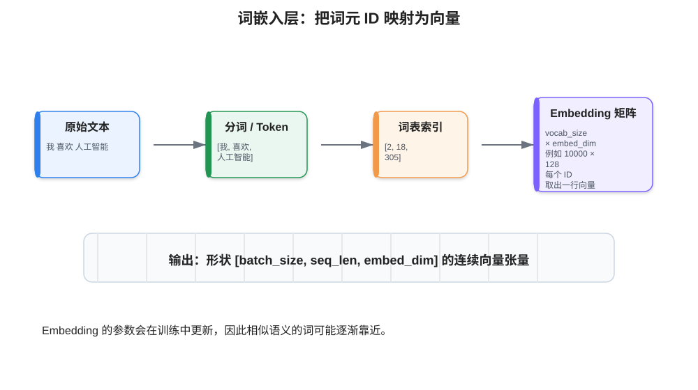
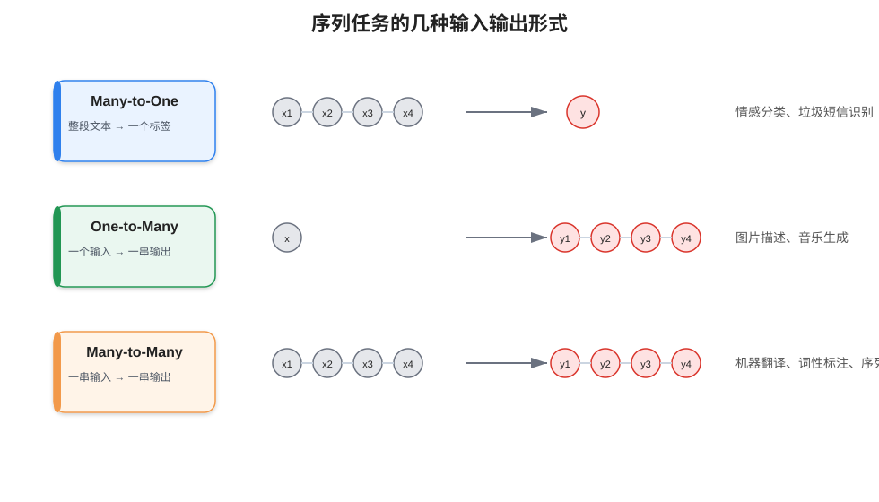
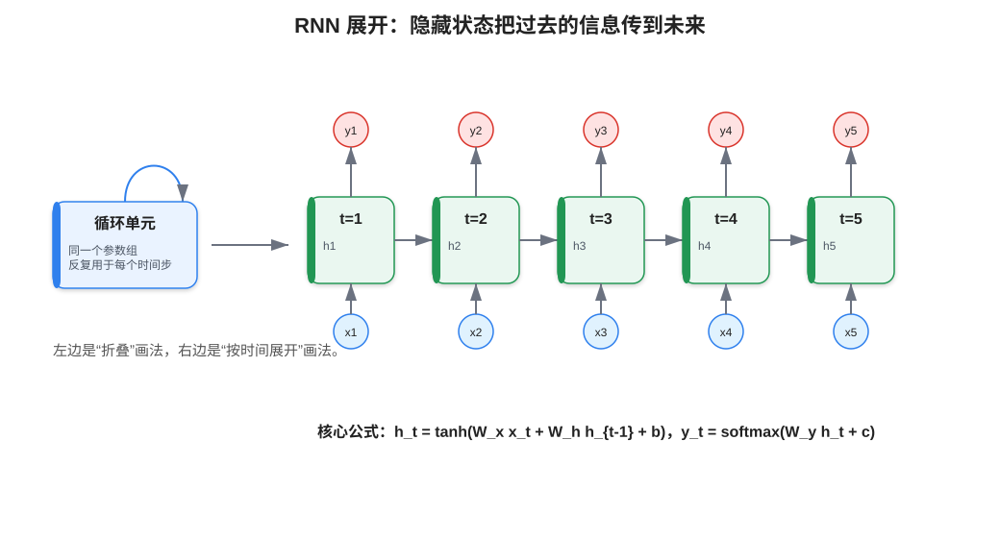
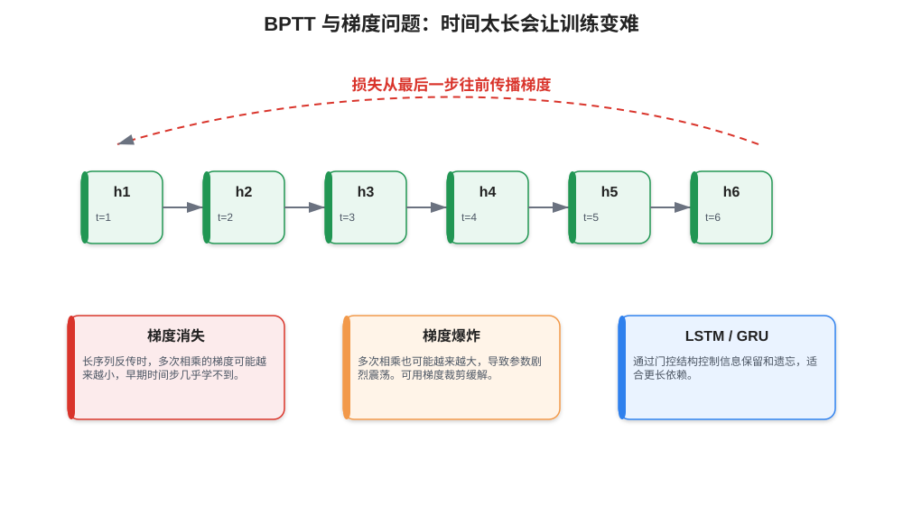
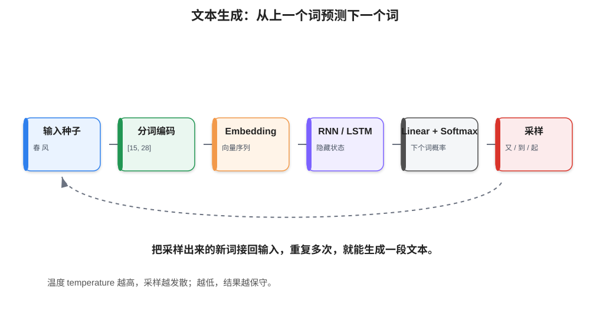

# 09 - RNN 与 NLP 细化版

> 本章目标：理解自然语言为什么需要数值化，理解词嵌入层、RNN 循环结构、隐藏状态、BPTT、LSTM/GRU 的作用，并能写出一个基础文本分类或文本生成模型。

---

## 0. 本章学习路径

建议顺序：

1. 理解 NLP 处理的是“序列数据”。
2. 理解文本必须先变成数字：分词、词表、token id、embedding。
3. 理解 RNN 的循环结构：当前输出不仅依赖当前输入，也依赖过去状态。
4. 理解 RNN 的问题：长序列中的梯度消失和梯度爆炸。
5. 理解 LSTM/GRU 为什么出现。
6. 用 PyTorch 写一个文本分类模型，再理解文本生成。

---

## 1. NLP 为什么比表格和图像更麻烦

表格数据天然就是数值，比如年龄、收入、点击次数。图像也可以比较自然地表示为像素矩阵，比如 RGB 三通道张量。

但文本是人类语言，例如：

```text
我喜欢人工智能
```

模型不能直接理解这些文字，所以必须先转成数字。常见流程是：

```text
文本
→ 分词 / tokenization
→ token id
→ 词向量 embedding
→ 模型输入
```



---

## 2. 什么是序列数据

序列数据的特点是：**后面的数据和前面的数据有关系**。

例如：

```text
我 今天 很 开心
```

“开心”的含义和前面的“我 今天 很”有关。再比如时间序列：

```text
今天温度 → 明天温度 → 后天温度
```

后面的值往往和前面的值有关。

RNN 适合处理这类数据，因为它具有隐藏状态，可以把前面时间步的信息传递到后面。

常见序列任务：

| 任务形式 | 输入 | 输出 | 例子 |
|---|---|---|---|
| Many-to-One | 一个序列 | 一个结果 | 情感分类、垃圾短信识别 |
| One-to-Many | 一个输入 | 一个序列 | 图片描述、音乐生成 |
| Many-to-Many | 一个序列 | 一个序列 | 机器翻译、词性标注、命名实体识别 |



---

## 3. 从全连接网络到 RNN

普通全连接网络处理一个样本时，通常只看当前输入：

```text
y = f(x)
```

如果输入是一句话，直接把一句话整体变成一个向量，模型很容易丢失词语顺序。

例如下面两句话词很像，但含义不同：

```text
我 不 喜欢 你
我 喜欢 不 你
```

虽然第二句不自然，但可以说明顺序很重要。

RNN 的核心思想是：

```text
当前时间步的隐藏状态 = 当前输入 + 上一时间步的隐藏状态
```

这样模型就不仅看当前词，还会参考前面已经读过的词。

---

## 4. RNN 的基本结构

RNN 可以画成一个带环的网络，也可以按时间展开。



基本公式：

```text
h_t = tanh(W_x x_t + W_h h_{t-1} + b)
y_t = W_y h_t + c
```

其中：

| 符号 | 含义 |
|---|---|
| `x_t` | 第 t 个时间步的输入，例如第 t 个词向量 |
| `h_t` | 第 t 个时间步的隐藏状态 |
| `h_{t-1}` | 上一个时间步的隐藏状态 |
| `W_x` | 输入到隐藏状态的权重 |
| `W_h` | 隐藏状态到隐藏状态的权重 |
| `y_t` | 第 t 个时间步的输出 |

直观理解：

```text
h_t 像是模型读到第 t 个词之后的“记忆状态”。
```

如果做情感分类，通常会取最后一个隐藏状态：

```text
整句话的表示 ≈ 最后时刻的 h_t
```

然后送入全连接层分类。

---

## 5. 词嵌入层 Embedding

### 5.1 为什么不直接用 token id

假设词表是：

```text
<PAD>: 0
<UNK>: 1
我: 2
喜欢: 3
人工智能: 4
```

一句话：

```text
我 喜欢 人工智能
```

可以转成：

```text
[2, 3, 4]
```

但这些数字本身没有数值大小意义。`人工智能=4` 并不代表它比 `喜欢=3` 大。直接把这些 id 当连续数值输入模型是不合适的。

Embedding 的做法是：给每个 token id 分配一个可学习向量。

如果词表大小是 `10000`，词向量维度是 `128`，则词嵌入矩阵形状是：

```text
[10000, 128]
```

输入 token id 后，本质上是从这个矩阵中“查表取向量”。

### 5.2 PyTorch 中的 Embedding

```python
import torch
import torch.nn as nn

embedding = nn.Embedding(
    num_embeddings=10000,  # 词表大小
    embedding_dim=128,     # 每个词的向量维度
    padding_idx=0          # PAD 对应的向量不参与正常学习
)

x = torch.tensor([
    [2, 3, 4, 0, 0],
    [5, 8, 9, 2, 0]
])

out = embedding(x)
print(out.shape)  # torch.Size([2, 5, 128])
```

这里：

```text
2 = batch_size
5 = seq_len
128 = embedding_dim
```

---

## 6. RNN 输入输出形状

在 PyTorch 中，如果设置：

```python
nn.RNN(input_size=128, hidden_size=64, batch_first=True)
```

则输入形状一般是：

```text
[batch_size, seq_len, input_size]
```

例如：

```text
[32, 50, 128]
```

含义是：

```text
32 条文本
每条文本最多 50 个词
每个词向量 128 维
```

输出：

```python
output, h_n = rnn(x)
```

常见形状：

```text
output: [batch_size, seq_len, hidden_size]
h_n:    [num_layers, batch_size, hidden_size]
```

如果是双向 RNN，隐藏维度会变成：

```text
hidden_size × 2
```

---

## 7. BPTT：RNN 怎么训练

普通神经网络通过反向传播训练。RNN 也通过反向传播训练，但因为它在时间维度上被展开，所以叫：

```text
Backpropagation Through Time，简称 BPTT
```

意思是：

```text
损失从最后输出开始，沿着时间步一步步往前传播。
```



RNN 的训练难点：

| 问题 | 解释 | 常见解决方式 |
|---|---|---|
| 梯度消失 | 梯度反传很多步后越来越小，早期词学不到 | LSTM、GRU、残差、注意力机制 |
| 梯度爆炸 | 梯度反传很多步后越来越大，训练不稳定 | 梯度裁剪 `clip_grad_norm_` |
| 长依赖困难 | 很久之前的信息难以保留 | LSTM、GRU、Transformer |

梯度裁剪示例：

```python
torch.nn.utils.clip_grad_norm_(model.parameters(), max_norm=5.0)
```

---

## 8. LSTM 和 GRU：为什么比普通 RNN 更常用

普通 RNN 只有一个隐藏状态，长序列中很容易忘记早期信息。

LSTM 和 GRU 引入“门控机制”，让模型学会：

```text
哪些信息该保留
哪些信息该忘记
哪些新信息该写入记忆
```

### 8.1 LSTM 的直观理解

LSTM 有一个类似“长期记忆”的状态 `c_t`，以及隐藏状态 `h_t`。

常见门：

| 门 | 作用 |
|---|---|
| 遗忘门 forget gate | 决定旧记忆保留多少 |
| 输入门 input gate | 决定新信息写入多少 |
| 输出门 output gate | 决定当前要输出多少 |

### 8.2 GRU 的直观理解

GRU 是 LSTM 的简化版本，参数更少，训练更快。

常见门：

| 门 | 作用 |
|---|---|
| 更新门 update gate | 控制旧状态和新状态的混合 |
| 重置门 reset gate | 控制遗忘过去信息的程度 |

入门建议：

```text
普通 RNN 用来理解原理
实际项目优先试 LSTM 或 GRU
更复杂 NLP 任务再学习 Transformer
```

---

## 9. 文本分类模型：Embedding + LSTM

下面是一个典型的文本分类模型。

```python
import torch
import torch.nn as nn

class TextClassifier(nn.Module):
    def __init__(self, vocab_size, embed_dim, hidden_size, num_classes, padding_idx=0):
        super().__init__()
        self.embedding = nn.Embedding(
            num_embeddings=vocab_size,
            embedding_dim=embed_dim,
            padding_idx=padding_idx
        )

        self.lstm = nn.LSTM(
            input_size=embed_dim,
            hidden_size=hidden_size,
            num_layers=1,
            batch_first=True,
            bidirectional=True
        )

        self.classifier = nn.Linear(hidden_size * 2, num_classes)

    def forward(self, input_ids):
        # input_ids: [batch_size, seq_len]
        x = self.embedding(input_ids)
        # x: [batch_size, seq_len, embed_dim]

        output, (h_n, c_n) = self.lstm(x)
        # output: [batch_size, seq_len, hidden_size * 2]

        # 取最后一个时间步，也可以做 mean pooling / max pooling
        last_hidden = output[:, -1, :]
        logits = self.classifier(last_hidden)
        return logits

model = TextClassifier(
    vocab_size=10000,
    embed_dim=128,
    hidden_size=64,
    num_classes=2
)

x = torch.randint(0, 10000, (32, 50))
logits = model(x)
print(logits.shape)  # torch.Size([32, 2])
```

训练时：

```python
criterion = nn.CrossEntropyLoss()
optimizer = torch.optim.Adam(model.parameters(), lr=1e-3)

for input_ids, labels in train_loader:
    optimizer.zero_grad()
    logits = model(input_ids)
    loss = criterion(logits, labels)
    loss.backward()
    torch.nn.utils.clip_grad_norm_(model.parameters(), max_norm=5.0)
    optimizer.step()
```

---

## 10. 文本生成：从当前词预测下一个词

文本生成的核心是：

```text
给定前面的词，预测下一个词的概率分布。
```



例如输入：

```text
春 风
```

模型输出下一个词的概率：

```text
又: 0.32
到: 0.18
起: 0.10
...
```

然后可以选择概率最高的词，或者按概率采样一个词。

生成流程：

1. 给模型一个起始文本。
2. 分词并转成 token id。
3. 输入模型，得到下一个 token 的概率分布。
4. 选择或采样一个 token。
5. 把新 token 接回输入序列。
6. 重复多次直到达到长度或遇到结束符。

### 10.1 贪心搜索 vs 随机采样

| 方法 | 做法 | 特点 |
|---|---|---|
| 贪心搜索 | 每次选概率最高的词 | 稳定但容易重复、死板 |
| 随机采样 | 按概率随机抽取 | 更丰富但可能跑偏 |
| Top-k | 只在概率最高的 k 个词中采样 | 控制随机范围 |
| Temperature | 调整概率分布平滑程度 | 越高越发散，越低越保守 |

---

## 11. 一个字符级文本生成模型雏形

下面是字符级语言模型的简化结构。

```python
class CharRNN(nn.Module):
    def __init__(self, vocab_size, embed_dim=64, hidden_size=128):
        super().__init__()
        self.embedding = nn.Embedding(vocab_size, embed_dim)
        self.rnn = nn.GRU(embed_dim, hidden_size, batch_first=True)
        self.fc = nn.Linear(hidden_size, vocab_size)

    def forward(self, input_ids, hidden=None):
        x = self.embedding(input_ids)
        output, hidden = self.rnn(x, hidden)
        logits = self.fc(output)
        return logits, hidden
```

训练目标是：

```text
输入: 春 风 又
目标: 风 又 绿
```

也就是让模型学会“下一个字符/词是什么”。

损失函数可以用：

```python
criterion = nn.CrossEntropyLoss()
```

注意 logits 形状通常是：

```text
[batch_size, seq_len, vocab_size]
```

而 CrossEntropyLoss 常要求：

```text
[batch_size * seq_len, vocab_size]
```

所以需要 reshape：

```python
logits = logits.reshape(-1, vocab_size)
targets = targets.reshape(-1)
loss = criterion(logits, targets)
```

---

## 12. RNN 常见问题排查

### 12.1 输入维度不对

`nn.LSTM(batch_first=True)` 要求输入：

```text
[batch_size, seq_len, embed_dim]
```

如果你传入的是：

```text
[seq_len, batch_size, embed_dim]
```

就会导致结果和预期不一致。

### 12.2 padding 影响结果

如果文本补了很多 `<PAD>`，最后一个时间步可能是 PAD。此时直接取：

```python
last_hidden = output[:, -1, :]
```

可能不合理。

更严谨的做法：

1. 记录每条文本真实长度。
2. 使用 `pack_padded_sequence`。
3. 或者对非 PAD 位置做 masked mean pooling。

### 12.3 训练很慢

RNN 是按时间步递推的，不像 CNN 那样容易并行，所以长文本会训练较慢。可以尝试：

- 限制最大文本长度。
- 使用 GRU 替代 LSTM。
- 减小 hidden size。
- 使用预训练模型或 Transformer。

---

## 13. 学习检查清单

学完本章，你应该能回答：

- 为什么文本必须先数值化？
- token id 和 embedding 向量有什么区别？
- RNN 的隐藏状态 `h_t` 代表什么？
- RNN 为什么适合处理序列数据？
- BPTT 是什么？
- 为什么 RNN 会出现梯度消失或梯度爆炸？
- LSTM/GRU 比普通 RNN 改进在哪里？
- 文本分类和文本生成在输入输出上有什么区别？

---

## 14. 练习任务

1. 用 `nn.RNN`、`nn.GRU`、`nn.LSTM` 分别写一个文本分类模型，对比参数量和训练速度。
2. 把 `bidirectional=True` 改成 `False`，观察输出维度变化。
3. 对一个 batch 的文本做 padding，并打印 embedding 后的形状。
4. 实现一个简单字符级文本生成器。
5. 尝试调整 temperature，观察生成文本风格变化。

---

[返回首页](../README.md)
