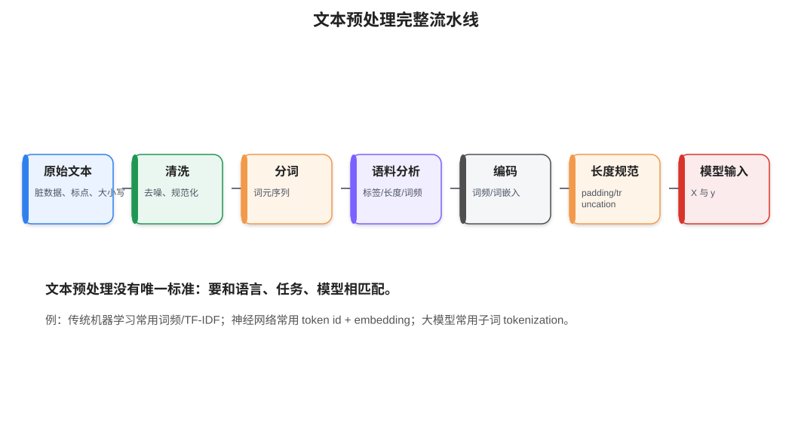
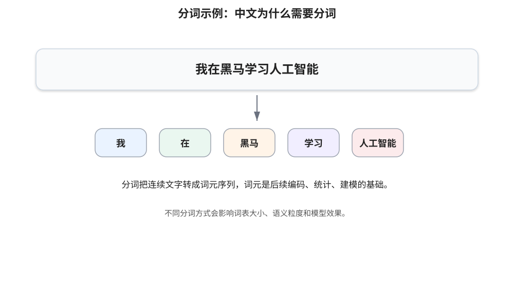
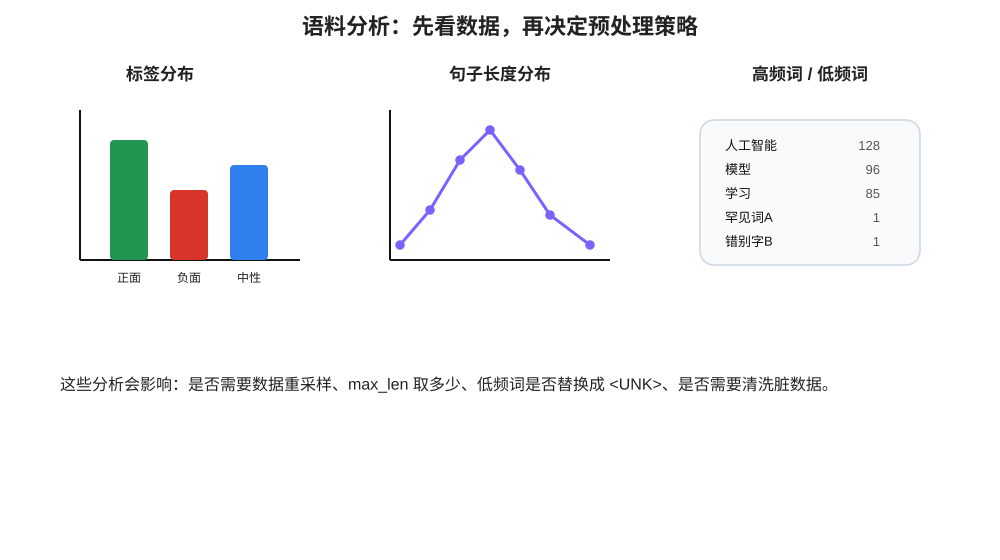
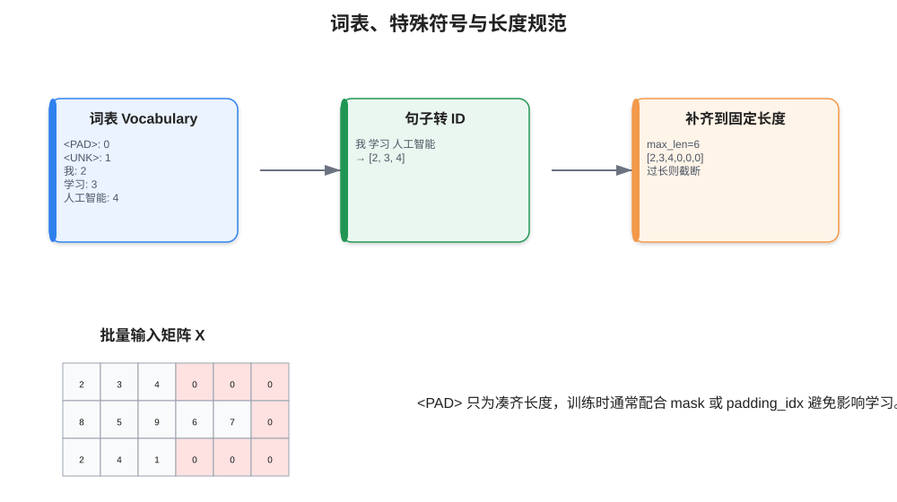
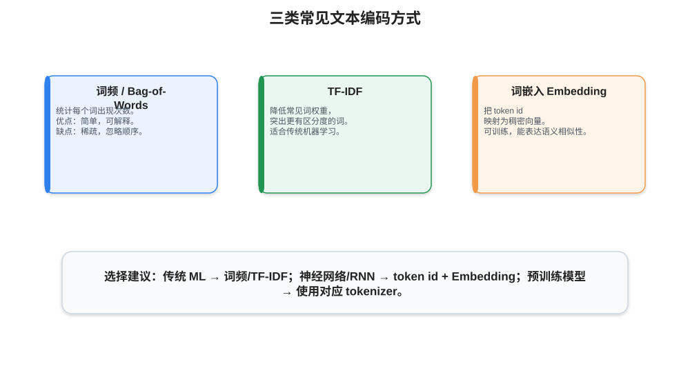

# 10 - 文本预处理细化版

> 本章目标：掌握 NLP 文本进入模型前的完整处理流程，包括文本清洗、分词、词性标注、命名实体识别、语料分析、n-gram 特征、长度规范、词频编码、词嵌入编码和数据增强。

---

## 0. 本章学习路径

文本预处理要解决的问题是：**把人类语言整理成模型能吃进去的 X 和 y**。

推荐学习顺序：

1. 了解 NLP、NLU、NLG 的基本概念。
2. 理解文本预处理为什么没有唯一标准。
3. 掌握分词、词性标注、命名实体识别。
4. 学会做语料分析：标签分布、句子长度、词频统计。
5. 掌握文本特征处理：n-gram、长度规范。
6. 掌握文本编码：词频编码、TF-IDF、Embedding。
7. 理解数据增强：回译、同义替换、随机删除等。
8. 能写出一个完整的文本分类数据处理流程。

---

## 1. NLP 与文本预处理

NLP，全称 Natural Language Processing，自然语言处理，目标是让计算机理解和生成人类语言。

常见分类：

| 类型 | 含义 | 任务例子 |
|---|---|---|
| NLU | Natural Language Understanding，自然语言理解 | 情感分析、实体识别、意图识别 |
| NLG | Natural Language Generation，自然语言生成 | 摘要、翻译、问答、文本续写 |
| 语音文字 | 语音和文本互转 | 语音识别 STT、语音合成 TTS |

文本预处理的核心任务：

```text
原始文本
→ 清洗
→ 分词
→ 编码
→ 补齐长度
→ 构造模型输入 X 和标签 y
```



文本预处理没有唯一方法。不同语言、不同任务、不同模型，需要的处理方式不同。

例如：

| 场景 | 可能的预处理方式 |
|---|---|
| 中文传统机器学习分类 | 分词 → 去停用词 → TF-IDF → 逻辑回归/SVM |
| 中文 RNN 文本分类 | 分词 → 词表 → token id → padding → embedding → RNN |
| BERT 类模型 | 使用模型自带 tokenizer → input_ids / attention_mask |
| 文本生成 | 分词 → 构造输入序列和下一个词标签 |

---

## 2. 文本清洗：先把明显脏数据处理掉

文本清洗不是越多越好，而是要服务于任务。

常见清洗内容：

| 清洗项 | 例子 | 是否一定要做 |
|---|---|---|
| 去 HTML 标签 | `<br>`, `<p>` | 网页数据常做 |
| 统一空格 | 多个空格变一个 | 通常建议做 |
| 全角半角转换 | `Ａ` → `A` | 中文场景常见 |
| 大小写统一 | `Apple` → `apple` | 英文传统模型常见 |
| 去特殊符号 | 表情、乱码 | 视任务而定 |
| 去停用词 | 的、了、是 | 传统词频模型常见，深度模型不一定需要 |

简单清洗示例：

```python
import re

def clean_text(text: str) -> str:
    text = text.strip()
    text = re.sub(r'\s+', ' ', text)
    text = re.sub(r'<.*?>', '', text)
    return text

text = '  我  喜欢<br>人工智能  '
print(clean_text(text))
```

注意：如果做情感分析，不要随便删除否定词，例如“不”“没”“无”。

```text
我喜欢这个产品
我不喜欢这个产品
```

如果把“不”当停用词删掉，两句话会变得很像，模型就难以判断情感。

---

## 3. 分词 Tokenization

分词就是把连续文本切成词元序列。

中文没有天然空格，所以中文任务通常需要分词。



例如：

```text
我在黑马学习人工智能
```

分词后：

```text
['我', '在', '黑马', '学习', '人工智能']
```

分词的作用：

1. 把文本切成基本语义单元。
2. 为词频统计、词表构建、文本编码做准备。
3. 影响模型能看到的语义粒度。

### 3.1 jieba 分词三种模式

常见中文分词库是 `jieba`。

```python
import jieba

text = '我在黑马学习人工智能'

# 精确模式：最常用，适合文本分析
print(list(jieba.cut(text, cut_all=False)))

# 全模式：尽可能多地切出词
print(list(jieba.cut(text, cut_all=True)))

# 搜索引擎模式：在精确模式基础上，对长词再切分
print(list(jieba.cut_for_search(text)))
```

选择建议：

| 模式 | 特点 | 适用场景 |
|---|---|---|
| 精确模式 | 尽量准确地切分 | 文本分类、情感分析 |
| 全模式 | 切出所有可能词 | 不太适合直接建模 |
| 搜索引擎模式 | 召回更多短词 | 搜索、关键词召回 |

### 3.2 分词粒度会影响模型

例如：

```text
人工智能
```

可以切成：

```text
['人工智能']
```

也可以切成：

```text
['人工', '智能']
```

如果数据量很少，词粒度过细可能丢失整体含义；如果词粒度过粗，词表可能很大，低频词变多。

---

## 4. 词性标注与命名实体识别

### 4.1 词性标注 POS Tagging

词性标注是给每个词标注语法类别。

例如：

```text
我/r 在/p 黑马/n 学习/v 人工智能/n
```

常见词性：

| 标记 | 含义 |
|---|---|
| n | 名词 |
| v | 动词 |
| a | 形容词 |
| r | 代词 |
| p | 介词 |

jieba 示例：

```python
import jieba.posseg as pseg

text = '我在黑马学习人工智能'
words = pseg.cut(text)

for word, flag in words:
    print(word, flag)
```

词性标注常用于：

- 关键词提取。
- 规则特征构造。
- 信息抽取。
- 过滤特定词性，例如只保留名词和动词。

### 4.2 命名实体识别 NER

命名实体识别是找出文本中的专有实体。

常见实体类型：

| 实体类型 | 例子 |
|---|---|
| 人名 | 张三、李四 |
| 地名 | 北京、上海 |
| 组织机构 | OpenAI、清华大学 |
| 时间 | 2026 年、今天 |
| 产品 | iPhone、ChatGPT |

例子：

```text
马斯克 在 特斯拉 发布 新产品
```

NER 可能识别：

```text
马斯克 / PERSON
特斯拉 / ORG
```

NER 常用于：

- 知识图谱。
- 智能客服。
- 信息抽取。
- 新闻分析。
- 搜索系统。

---

## 5. 语料分析：建模前一定要先看数据

很多初学者拿到文本数据后直接训练模型，这是不推荐的。更好的做法是先做语料分析。



### 5.1 标签分布

分类任务中，先看标签是否均衡。

```python
from collections import Counter

labels = [1, 0, 1, 1, 0, 2, 1]
print(Counter(labels))
```

如果数据极度不均衡，例如：

```text
正类: 9500
负类: 500
```

模型可能只学会预测正类，也能得到很高准确率，但实际效果很差。

可以考虑：

- 使用 F1、Precision、Recall，而不是只看 Accuracy。
- 类别重采样。
- 给损失函数加类别权重。
- 补充少数类数据。

### 5.2 句子长度分布

RNN 和 Transformer 通常要求 batch 内序列长度一致，所以需要 padding 或 truncation。`max_len` 不能随便定，应该根据句子长度分布来决定。

```python
def sentence_length(tokens):
    return len(tokens)

lengths = [sentence_length(x) for x in tokenized_texts]
print('平均长度:', sum(lengths) / len(lengths))
print('最大长度:', max(lengths))
```

可以选择覆盖大多数样本的长度，例如 95 分位数：

```python
import numpy as np

max_len = int(np.percentile(lengths, 95))
print(max_len)
```

### 5.3 词频统计

词频统计可以帮助判断：

- 哪些词是高频词？
- 是否有大量错别字、乱码？
- 低频词是否过多？
- 词表大小应该设多少？

```python
from collections import Counter

counter = Counter()
for tokens in tokenized_texts:
    counter.update(tokens)

print(counter.most_common(20))
```

低频词处理策略：

```text
出现次数 < 2 或 < 5 的词 → 替换成 <UNK>
```

---

## 6. n-gram 特征

n-gram 是连续 n 个词组成的特征。

例如句子：

```text
我 喜欢 人工智能
```

1-gram：

```text
我
喜欢
人工智能
```

2-gram：

```text
我_喜欢
喜欢_人工智能
```

3-gram：

```text
我_喜欢_人工智能
```

n-gram 可以捕捉局部短语信息。

例如：

```text
不 喜欢
非常 好
值得 推荐
```

这些短语比单个词更有情感判断价值。

生成 n-gram 示例：

```python
def make_ngrams(tokens, n=2):
    return ['_'.join(tokens[i:i+n]) for i in range(len(tokens)-n+1)]

tokens = ['我', '不', '喜欢', '这个', '产品']
print(make_ngrams(tokens, 2))
```

输出：

```text
['我_不', '不_喜欢', '喜欢_这个', '这个_产品']
```

---

## 7. 词表、特殊符号与长度规范

神经网络通常不能直接接收字符串，而是接收 token id。



### 7.1 构建词表

常见特殊符号：

| 符号 | 作用 |
|---|---|
| `<PAD>` | 补齐长度 |
| `<UNK>` | 未登录词，不在词表里的词 |
| `<BOS>` | 句子开始，常用于生成任务 |
| `<EOS>` | 句子结束，常用于生成任务 |

构建词表示例：

```python
from collections import Counter

SPECIAL_TOKENS = ['<PAD>', '<UNK>']

def build_vocab(tokenized_texts, min_freq=2, max_size=None):
    counter = Counter()
    for tokens in tokenized_texts:
        counter.update(tokens)

    words = [w for w, c in counter.items() if c >= min_freq]
    words = sorted(words, key=lambda w: counter[w], reverse=True)

    if max_size is not None:
        words = words[:max_size - len(SPECIAL_TOKENS)]

    idx_to_token = SPECIAL_TOKENS + words
    token_to_idx = {token: idx for idx, token in enumerate(idx_to_token)}
    return token_to_idx, idx_to_token
```

### 7.2 文本转 ID

```python
def tokens_to_ids(tokens, token_to_idx):
    unk_id = token_to_idx['<UNK>']
    return [token_to_idx.get(token, unk_id) for token in tokens]
```

### 7.3 Padding 和 Truncation

```python
def pad_or_truncate(ids, max_len, pad_id=0):
    if len(ids) >= max_len:
        return ids[:max_len]
    return ids + [pad_id] * (max_len - len(ids))
```

例如：

```text
原始: [2, 3, 4]
max_len = 6
补齐: [2, 3, 4, 0, 0, 0]
```

---

## 8. 文本编码方式



### 8.1 词频编码 Bag-of-Words

词频编码统计每个词出现了多少次。

例如词表：

```text
['我', '喜欢', '人工智能']
```

句子：

```text
我 喜欢 喜欢 人工智能
```

词频向量：

```text
[1, 2, 1]
```

优点：简单、可解释。缺点：忽略词序，向量稀疏。

### 8.2 TF-IDF

TF-IDF 会降低“到处都出现的词”的权重，提高“更有区分度的词”的权重。

适合传统机器学习模型：

```text
TF-IDF → 逻辑回归 / SVM / 朴素贝叶斯
```

sklearn 示例：

```python
from sklearn.feature_extraction.text import TfidfVectorizer

texts = [
    '我 喜欢 人工智能',
    '我 喜欢 机器学习',
    '这个 产品 不 好'
]

vectorizer = TfidfVectorizer(token_pattern=r'(?u)\b\w+\b')
X = vectorizer.fit_transform(texts)
print(X.shape)
```

### 8.3 词嵌入编码 Embedding

词嵌入是神经网络中更常用的方式。

流程：

```text
文本 → 分词 → token id → Embedding 向量 → 模型
```

Embedding 的优点：

1. 稠密向量，比词频向量更紧凑。
2. 可以训练出语义相似性。
3. 适合 RNN、CNN、Transformer 等神经网络。

PyTorch 示例：

```python
import torch
import torch.nn as nn

embedding = nn.Embedding(num_embeddings=5000, embedding_dim=128, padding_idx=0)
input_ids = torch.tensor([[2, 3, 4, 0], [5, 6, 0, 0]])
output = embedding(input_ids)
print(output.shape)  # [2, 4, 128]
```

---

## 9. 构造 Dataset 和 DataLoader

假设你已经有：

```text
texts: 原始文本列表
labels: 标签列表
```

可以这样构造数据集：

```python
import jieba
import torch
from torch.utils.data import Dataset, DataLoader

class TextDataset(Dataset):
    def __init__(self, texts, labels, token_to_idx, max_len=64):
        self.texts = texts
        self.labels = labels
        self.token_to_idx = token_to_idx
        self.max_len = max_len
        self.pad_id = token_to_idx['<PAD>']
        self.unk_id = token_to_idx['<UNK>']

    def __len__(self):
        return len(self.texts)

    def __getitem__(self, idx):
        text = clean_text(self.texts[idx])
        tokens = list(jieba.cut(text))
        ids = [self.token_to_idx.get(t, self.unk_id) for t in tokens]
        ids = pad_or_truncate(ids, self.max_len, self.pad_id)

        return {
            'input_ids': torch.tensor(ids, dtype=torch.long),
            'label': torch.tensor(self.labels[idx], dtype=torch.long)
        }

# dataset = TextDataset(texts, labels, token_to_idx, max_len=64)
# loader = DataLoader(dataset, batch_size=32, shuffle=True)
```

训练时：

```python
for batch in loader:
    input_ids = batch['input_ids']
    labels = batch['label']
```

---

## 10. 数据增强

文本数据增强的目标是：在尽量不改变标签的情况下，生成更多训练样本。

常见方法：

| 方法 | 思路 | 注意 |
|---|---|---|
| 回译 | 中文 → 英文 → 中文 | 质量取决于翻译模型 |
| 同义词替换 | 把词换成近义词 | 容易改变语气或语义 |
| 随机删除 | 删除少量不重要词 | 不能删除否定词、关键词 |
| 随机交换 | 交换相邻词 | 中文语序变化可能影响语义 |
| EDA | 多种简单增强组合 | 需要人工抽样检查 |

### 10.1 回译示意

```text
原句：这个课程讲得很清楚
中文 → 英文：This course is explained clearly
英文 → 中文：这门课解释得很清楚
```

如果标签是“正面评价”，增强后标签仍然可以保持为正面。

### 10.2 数据增强注意事项

不要盲目增强。增强后的文本必须保持原标签。

例如情感分析中：

```text
这个产品很好
这个产品不好
```

只差一个字，但标签完全相反。所以涉及否定词时要特别小心。

---

## 11. 文本预处理完整示例

下面串起来一个最小流程：

```python
import jieba
from collections import Counter

texts = [
    '我喜欢人工智能',
    '这个课程讲得很清楚',
    '这个产品不好用'
]
labels = [1, 1, 0]

# 1. 清洗 + 分词
tokenized_texts = []
for text in texts:
    text = clean_text(text)
    tokens = list(jieba.cut(text))
    tokenized_texts.append(tokens)

# 2. 语料分析
lengths = [len(tokens) for tokens in tokenized_texts]
print('句子长度:', lengths)

counter = Counter()
for tokens in tokenized_texts:
    counter.update(tokens)
print('词频:', counter.most_common())

# 3. 构建词表
token_to_idx, idx_to_token = build_vocab(tokenized_texts, min_freq=1)

# 4. 文本转 ID + padding
max_len = 8
all_ids = []
for tokens in tokenized_texts:
    ids = tokens_to_ids(tokens, token_to_idx)
    ids = pad_or_truncate(ids, max_len, token_to_idx['<PAD>'])
    all_ids.append(ids)

print(all_ids)
```

---

## 12. 常见错误排查

### 12.1 训练集和测试集使用了不同词表

错误做法：

```text
训练集构建一个词表
测试集又重新构建一个词表
```

这样同一个词在训练和测试时可能对应不同 id，模型会混乱。

正确做法：

```text
只在训练集上构建词表
验证集和测试集使用训练集词表
不认识的词统一映射为 <UNK>
```

### 12.2 忘记 padding

如果一个 batch 中每条文本长度不同，不能直接组成一个规则张量。

解决方式：

```text
padding 到固定长度
或者使用 collate_fn 动态 padding
```

### 12.3 把 `<PAD>` 当成正常词学习

如果使用 `nn.Embedding`，建议设置：

```python
nn.Embedding(vocab_size, embed_dim, padding_idx=0)
```

这样 `<PAD>` 对应的向量不会像普通词一样被更新。

### 12.4 数据泄漏

不要在全量数据上先统计词表、做标准化、选择特征，然后再划分训练集和测试集。更严谨的做法是：

```text
先划分 train / valid / test
只用 train 拟合词表、统计规则
再应用到 valid / test
```

---

## 13. 学习检查清单

学完本章，你应该能回答：

- NLP、NLU、NLG 分别是什么意思？
- 为什么文本预处理没有统一标准？
- 中文为什么通常需要分词？
- 词性标注和命名实体识别分别解决什么问题？
- 为什么要分析标签分布和句子长度分布？
- n-gram 能捕捉什么信息？
- `<PAD>` 和 `<UNK>` 分别有什么作用？
- 词频编码、TF-IDF、Embedding 有什么区别？
- 数据增强为什么可能改变标签？

---

## 14. 练习任务

1. 找 20 条中文评论，手动分成正负两类，完成分词和词频统计。
2. 画出每条文本的长度分布，选择一个合适的 `max_len`。
3. 构建词表，统计 `<UNK>` 占比。
4. 用 TF-IDF + 逻辑回归做一个基线模型。
5. 用 Embedding + LSTM 做一个神经网络版本，并比较效果。

---

[返回首页](../README.md)
