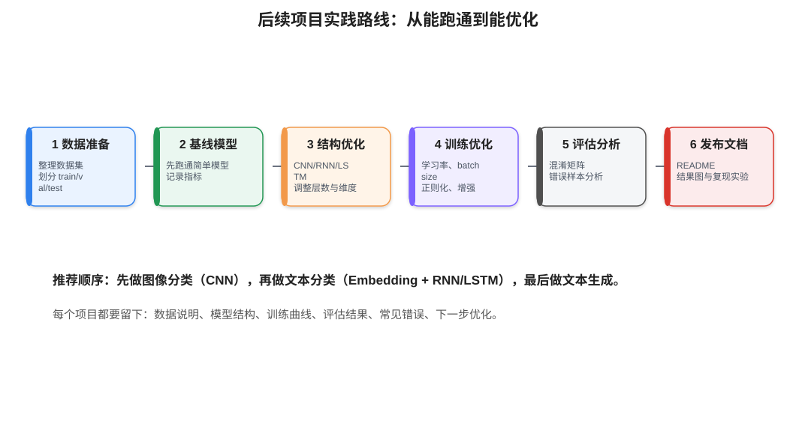

# 11 - 项目实践路线细化版

> 本章目标：把前面学到的 CNN、RNN、文本预处理串成可落地项目。每个项目都强调“能跑通、能解释、能优化、能记录”。

---

## 0. 项目学习原则

学习 AI 时，项目不要一开始就追求复杂。更好的路线是：

```text
先跑通最小版本
→ 保存实验结果
→ 找到错误样本
→ 做一次可解释优化
→ 写进 GitHub 文档
```



每个项目建议固定保留这些内容：

```text
项目目标
数据来源
数据字段说明
模型结构
训练参数
训练曲线
评估指标
错误样本分析
下一步优化方向
```

---

## 1. 项目一：CIFAR-10 图像分类

### 1.1 项目目标

使用 CNN 对 CIFAR-10 图像进行 10 分类。

CIFAR-10 类别包括：

```text
airplane, automobile, bird, cat, deer, dog, frog, horse, ship, truck
```

你需要完成：

1. 加载数据。
2. 图像预处理和增强。
3. 构建 CNN。
4. 训练和评估。
5. 保存模型。
6. 分析错误分类图片。

### 1.2 推荐目录结构

```text
projects/cifar10-cnn/
├── README.md
├── train.py
├── evaluate.py
├── model.py
├── utils.py
├── checkpoints/
└── outputs/
    ├── training_curve.png
    └── confusion_matrix.png
```

### 1.3 基线模型

先用最小 CNN 跑通：

```python
class CifarCNN(nn.Module):
    def __init__(self):
        super().__init__()
        self.features = nn.Sequential(
            nn.Conv2d(3, 32, 3, padding=1),
            nn.ReLU(),
            nn.MaxPool2d(2),
            nn.Conv2d(32, 64, 3, padding=1),
            nn.ReLU(),
            nn.MaxPool2d(2),
        )
        self.classifier = nn.Sequential(
            nn.Flatten(),
            nn.Linear(64 * 8 * 8, 256),
            nn.ReLU(),
            nn.Dropout(0.3),
            nn.Linear(256, 10)
        )

    def forward(self, x):
        return self.classifier(self.features(x))
```

### 1.4 记录指标

训练时建议记录：

| 指标 | 含义 |
|---|---|
| train_loss | 训练集损失 |
| train_acc | 训练集准确率 |
| val_loss | 验证集损失 |
| val_acc | 验证集准确率 |

如果训练准确率很高，验证准确率低，说明可能过拟合。

### 1.5 优化方向

| 问题 | 可能原因 | 优化方法 |
|---|---|---|
| 欠拟合 | 模型太小、训练不够 | 增加卷积通道、训练更多 epoch |
| 过拟合 | 模型太大、数据少 | Dropout、数据增强、权重衰减 |
| 训练不稳定 | 学习率不合适 | 调小学习率、使用学习率衰减 |
| 某些类别差 | 类别特征相似 | 看混淆矩阵，增强特定类别样本 |

---

## 2. 项目二：中文评论情感分类

### 2.1 项目目标

给定一条中文评论，判断它是正面还是负面。

例如：

```text
这个课程讲得很清楚 → 正面
这个产品一点也不好用 → 负面
```

### 2.2 完整流程

```text
原始评论
→ 清洗
→ 分词
→ 构建词表
→ token id
→ padding
→ Embedding + LSTM
→ 二分类输出
```

### 2.3 数据处理重点

你需要重点检查：

1. 正负样本是否均衡。
2. 文本长度分布。
3. 高频词和低频词。
4. 否定词是否被误删。
5. 测试集中 `<UNK>` 占比是否过高。

### 2.4 模型建议

入门版本：

```text
Embedding → BiLSTM → Linear → logits
```

损失函数：

```python
nn.CrossEntropyLoss()
```

输出类别：

```text
0 = 负面
1 = 正面
```

### 2.5 评估指标

不要只看准确率。建议同时看：

```text
Accuracy
Precision
Recall
F1
Confusion Matrix
```

如果负样本比较少，F1 比 Accuracy 更有参考价值。

---

## 3. 项目三：歌词或短文本生成

### 3.1 项目目标

使用字符级或词级 RNN/GRU/LSTM，训练一个简单文本生成模型。

输入：

```text
春风
```

输出可能是：

```text
春风又绿江南岸...
```

### 3.2 数据构造

假设文本为：

```text
春风又绿江南岸
```

字符级训练样本可以构造为：

```text
输入: 春 风 又 绿
目标: 风 又 绿 江
```

也就是预测下一个字符。

### 3.3 模型结构

```text
Embedding → GRU/LSTM → Linear(vocab_size)
```

输出维度：

```text
[batch_size, seq_len, vocab_size]
```

### 3.4 生成策略

| 策略 | 特点 |
|---|---|
| 贪心搜索 | 每次选概率最高，稳定但容易重复 |
| 随机采样 | 结果更多样，但可能跑偏 |
| Top-k | 只从概率最高的 k 个候选里采样 |
| Temperature | 控制生成保守或发散 |

---

## 4. 项目四：文本预处理可视化报告

这个项目不一定训练模型，重点是做数据分析报告。

### 4.1 报告内容

建议包含：

```text
数据总量
标签数量分布
句子长度分布
高频词 Top 50
低频词数量
空文本数量
重复文本数量
分词样例
词表大小
UNK 占比
```

### 4.2 为什么这个项目重要

很多模型效果不好，不是模型结构问题，而是数据问题。

例如：

| 现象 | 可能影响 |
|---|---|
| 标签极度不均衡 | 模型偏向多数类 |
| 文本太短 | 信息不足 |
| 文本太长 | padding 浪费，训练慢 |
| 大量重复样本 | 评估结果虚高 |
| 大量脏数据 | 模型学到噪声 |

---

## 5. 项目五：把模型结果写进 GitHub 文档

一个对别人有帮助的 AI 项目，不只是代码能跑，还要能解释。

README 建议结构：

```md
# 项目名称

## 项目目标

## 数据说明

## 环境安装

## 训练方法

## 模型结构

## 实验结果

## 错误样本分析

## 下一步优化
```

实验结果建议用表格：

```md
| 模型 | Accuracy | Precision | Recall | F1 |
|---|---:|---:|---:|---:|
| TF-IDF + LogisticRegression | 0.82 | 0.80 | 0.79 | 0.79 |
| Embedding + BiLSTM | 0.86 | 0.85 | 0.84 | 0.84 |
```

---

## 6. 推荐实践顺序

建议按这个顺序做：

```text
第 1 个项目：CIFAR-10 CNN 图像分类
第 2 个项目：中文评论文本预处理报告
第 3 个项目：TF-IDF + 逻辑回归文本分类
第 4 个项目：Embedding + LSTM 文本分类
第 5 个项目：RNN/GRU 文本生成
```

这样安排的原因：

1. CNN 项目最直观，容易看到输入图片和预测结果。
2. 文本预处理报告能帮你理解 NLP 数据的复杂性。
3. 先做传统文本分类，可以建立基线。
4. 再做 LSTM，才能知道深度模型是否真的提升。
5. 最后做生成任务，理解序列预测。

---

## 7. 项目复盘模板

每做完一个项目，都写一次复盘：

```md
## 本次实验

模型：
数据：
训练轮数：
学习率：
batch size：

## 结果

训练集准确率：
验证集准确率：
测试集准确率：

## 观察

1. 哪些类别容易错？
2. 是否过拟合？
3. 数据是否有明显问题？

## 下一步

1. 优化模型结构
2. 增加数据增强
3. 调整学习率
4. 增加错误样本分析
```

---

## 8. 学习检查清单

学完本章，你应该能回答：

- 图像分类项目需要哪些步骤？
- 文本分类项目为什么要先做预处理？
- 为什么要先建立基线模型？
- 为什么实验结果要记录训练集和验证集？
- 如何判断过拟合和欠拟合？
- GitHub 项目 README 应该包含哪些内容？

---

[返回首页](../README.md)
