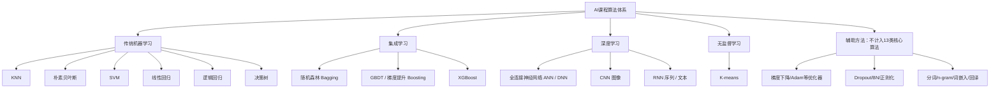

# AI 课程算法清单：作用、功能与适用场景

> 整理口径：本文件根据你上传的所有课程资料整理。  
> 按“可以作为模型进行训练、预测或聚类的核心算法/网络结构”计算，本阶段共整理为 **13 类核心算法**。  
> 另外，课程中还学习了若干 **训练优化方法、正则化方法、文本预处理方法**，这些不单独算作“模型算法”，但在实际项目中同样重要，已放在附录。

---

## 0. 总览：我们学了多少种算法？

### 0.1 核心模型算法：13 类

| 序号 | 算法/网络 | 英文 | 主要任务 | 关键词 |
|---:|---|---|---|---|
| 1 | K 最近邻 | K-Nearest Neighbors, KNN | 分类、回归 | 距离、近邻投票 |
| 2 | 朴素贝叶斯 | Naive Bayes | 分类 | 概率、贝叶斯、条件独立 |
| 3 | 支持向量机 | Support Vector Machine, SVM | 分类 | 间隔最大化、超平面、核函数 |
| 4 | 线性回归 | Linear Regression | 回归 | 拟合直线、预测连续值 |
| 5 | 逻辑回归 | Logistic Regression | 分类 | Sigmoid、概率、二分类 |
| 6 | 全连接神经网络 | Fully Connected Neural Network / ANN / DNN | 分类、回归 | 多层、非线性、特征学习 |
| 7 | 决策树 | Decision Tree | 分类、回归 | if-else、树结构、规则划分 |
| 8 | 随机森林 | Random Forest | 分类、回归 | Bagging、多棵树、投票/平均 |
| 9 | 梯度提升 / GBDT | Gradient Boosting / Gradient Boosting Decision Tree | 分类、回归 | Boosting、残差、串行提升 |
| 10 | XGBoost | Extreme Gradient Boosting | 分类、回归 | GBDT 改进、正则化、二阶信息 |
| 11 | K 均值聚类 | K-means | 聚类 | 无监督、相似样本分组 |
| 12 | 卷积神经网络 | Convolutional Neural Network, CNN | 图像分类、视觉任务 | 卷积、池化、局部特征 |
| 13 | 循环神经网络 | Recurrent Neural Network, RNN | 序列、文本、时间序列 | 隐藏状态、时序依赖 |

### 0.2 一张图看整体关系



---

# 1. K 最近邻 KNN

## 1.1 它解决什么问题？

KNN 可以用于 **分类** 和 **回归**。  
它的核心思想非常直观：**一个样本属于哪一类，可以看看它周围最近的 K 个样本大多数属于哪一类。**

例如：  
你不知道一个新用户是否会购买某商品，可以找出和这个用户最相似的 K 个历史用户。如果这些用户大多数购买了，那么新用户也很可能购买。

## 1.2 核心原理

KNN 一般分三步：

1. 计算新样本和所有已知样本之间的距离。
2. 找出距离最近的 K 个样本。
3. 分类任务用“多数投票”，回归任务用“平均值”。

## 1.3 作用和功能

| 功能 | 说明 |
|---|---|
| 分类 | 判断样本属于哪个类别，例如垃圾邮件识别、用户分类 |
| 回归 | 预测连续值，例如根据相似房源预测房价 |
| 相似样本检索 | 找出和当前样本最像的一批样本 |

## 1.4 优点

- 思想简单，容易理解。
- 不需要复杂训练过程。
- 对非线性边界也能有一定效果。

## 1.5 缺点

- 数据量大时预测很慢，因为要和很多样本计算距离。
- 对特征尺度敏感，所以通常需要归一化。
- K 值选择会影响效果。
- 高维数据中距离可能不稳定。

## 1.6 适合场景

- 小规模数据。
- 需要快速做一个基线模型。
- 推荐系统中的相似用户、相似物品检索。

---

# 2. 朴素贝叶斯 Naive Bayes

## 2.1 它解决什么问题？

朴素贝叶斯主要用于 **分类任务**，尤其常见于文本分类，例如：

- 垃圾邮件识别
- 新闻分类
- 情感分析
- 评论正负面判断

## 2.2 核心原理

朴素贝叶斯基于贝叶斯公式：

```text
P(类别 | 特征) = P(特征 | 类别) * P(类别) / P(特征)
```

它的“朴素”体现在一个假设上：  
**各个特征之间相互独立。**

这个假设在现实中不一定完全成立，但在文本分类中经常能取得不错效果。

## 2.3 作用和功能

| 功能 | 说明 |
|---|---|
| 文本分类 | 根据词语出现情况判断文本类别 |
| 快速分类 | 训练速度快，适合大规模文本 |
| 概率判断 | 输出某样本属于各类别的概率倾向 |

## 2.4 优点

- 训练速度快。
- 对小数据也比较友好。
- 在文本分类中表现稳定。
- 可解释性较强。

## 2.5 缺点

- 特征独立假设过强。
- 如果某个词在训练集中没出现过，容易造成概率为 0，需要平滑处理。
- 复杂非线性关系表达能力有限。

## 2.6 适合场景

- 文本分类。
- 垃圾邮件识别。
- 新闻主题分类。
- 情感分析初版模型。

---

# 3. 支持向量机 SVM

## 3.1 它解决什么问题？

SVM 主要用于 **分类任务**，也可以扩展到回归。  
它的目标是找到一个最优分割边界，让不同类别之间的间隔尽可能大。

## 3.2 核心原理

假设有两类点，SVM 会寻找一条线、一个平面或一个高维超平面，把两类样本分开。  
它不只是“分开”，而是希望边界距离两边最近样本都尽量远。

这些离边界最近、决定边界位置的样本，叫做 **支持向量**。

## 3.3 作用和功能

| 功能 | 说明 |
|---|---|
| 二分类 | 例如判断是否患病、是否欺诈 |
| 多分类 | 可通过一对一、一对多方式扩展 |
| 非线性分类 | 通过核函数处理复杂边界 |

## 3.4 优点

- 在中小规模数据上效果好。
- 对高维特征较友好。
- 间隔最大化思想有较好的泛化能力。
- 核函数可以处理非线性问题。

## 3.5 缺点

- 大规模数据训练较慢。
- 参数选择比较重要。
- 对噪声和异常值可能敏感。
- 输出概率不如逻辑回归自然。

## 3.6 适合场景

- 中小规模分类任务。
- 文本分类、图像特征分类。
- 特征维度较高但样本量不是特别大的任务。

---

# 4. 线性回归 Linear Regression

## 4.1 它解决什么问题？

线性回归用于 **回归问题**，也就是预测连续数值。

例如：

- 预测房价
- 预测销售额
- 预测温度
- 预测用户消费金额

## 4.2 核心原理

线性回归假设输入特征和目标值之间存在近似线性关系：

```text
y = b + w1*x1 + w2*x2 + ... + wn*xn
```

其中：

- `w` 是权重
- `b` 是偏置
- `y` 是预测值

模型训练的目标是找到一组合适的 `w` 和 `b`，让预测值和真实值尽可能接近。

## 4.3 作用和功能

| 功能 | 说明 |
|---|---|
| 连续值预测 | 预测价格、销量、成绩、收入等 |
| 建立基线模型 | 常作为回归任务的第一版模型 |
| 解释特征影响 | 权重可以反映特征对结果的影响方向和强弱 |

## 4.4 优点

- 简单、速度快。
- 可解释性强。
- 适合做回归任务基线。
- 对线性关系效果好。

## 4.5 缺点

- 只能表达线性关系。
- 对异常值敏感。
- 特征之间强相关时可能影响稳定性。
- 复杂任务表现有限。

## 4.6 适合场景

- 目标值是连续数值。
- 数据关系近似线性。
- 需要模型可解释性。

---

# 5. 逻辑回归 Logistic Regression

## 5.1 它解决什么问题？

逻辑回归虽然名字里有“回归”，但它主要用于 **分类任务**，尤其是 **二分类任务**。

例如：

- 是否患病
- 是否违约
- 是否购买
- 是否垃圾邮件

## 5.2 核心原理

逻辑回归先做线性计算：

```text
z = b + w1*x1 + w2*x2 + ... + wn*xn
```

再通过 Sigmoid 函数把结果压缩到 0 到 1 之间：

```text
p = sigmoid(z)
```

这个 `p` 可以理解为“属于正类的概率”。

## 5.3 作用和功能

| 功能 | 说明 |
|---|---|
| 二分类 | 输出属于某类别的概率 |
| 风险评分 | 例如违约概率、患病概率 |
| 可解释分类模型 | 权重能帮助分析特征影响 |

## 5.4 优点

- 简单、稳定、可解释。
- 训练速度快。
- 输出概率，方便设置阈值。
- 常作为分类任务基线。

## 5.5 缺点

- 表达能力有限，主要适合线性可分或近似线性可分问题。
- 对特征工程依赖较强。
- 复杂非线性任务效果不如树模型和神经网络。

## 5.6 适合场景

- 二分类任务。
- 风控评分。
- 医疗风险预测。
- 广告点击率预估的基础版本。

---

# 6. 全连接神经网络 ANN / DNN

## 6.1 它解决什么问题？

全连接神经网络可以用于 **分类** 和 **回归**。  
它是深度学习最基础的网络结构，也是理解 CNN、RNN 的前置知识。

课程中出现过的叫法包括：

- ANN：Artificial Neural Network
- DNN：Dense Neural Network / Deep Neural Network
- FNN：Feed-forward Neural Network
- FC：Fully Connected Layer

## 6.2 核心原理

全连接神经网络由输入层、隐藏层、输出层组成。  
每一层会做两件事：

1. 线性变换：`z = Wx + b`
2. 非线性激活：`a = activation(z)`

多层叠加后，模型可以学习比线性回归、逻辑回归更复杂的非线性关系。

## 6.3 作用和功能

| 功能 | 说明 |
|---|---|
| 自动学习特征组合 | 不再完全依赖人工设计简单特征 |
| 分类 | 输出类别概率 |
| 回归 | 输出连续预测值 |
| 作为深度学习基础模块 | CNN、RNN、Transformer 中也常用全连接层输出结果 |

## 6.4 优点

- 表达能力强。
- 能拟合复杂非线性关系。
- 可扩展为更深、更复杂的网络。
- 是深度学习的基础结构。

## 6.5 缺点

- 参数较多，容易过拟合。
- 对数据量和训练技巧要求更高。
- 可解释性较弱。
- 对图像、序列等结构化信号利用不如 CNN、RNN 专门网络。

## 6.6 适合场景

- 表格数据分类、回归。
- 简单深度学习入门项目。
- 作为其他网络最后的分类器或回归器。

---

# 7. 决策树 Decision Tree

## 7.1 它解决什么问题？

决策树可以用于 **分类** 和 **回归**。  
它像一套 if-else 判断规则，根据特征一步步把样本划分到不同结果中。

例如：

```text
如果 年龄 < 30
    如果 收入 > 8000
        预测：会购买
    否则
        预测：不会购买
否则
    ...
```

## 7.2 核心原理

决策树训练时会不断选择一个最合适的特征进行划分，让划分后的数据更“纯”。

常见划分标准包括：

- 信息增益
- 信息增益率
- 基尼系数
- 均方误差

## 7.3 作用和功能

| 功能 | 说明 |
|---|---|
| 分类 | 根据规则判断类别 |
| 回归 | 叶子节点输出平均值 |
| 规则解释 | 可以解释模型为什么这样判断 |
| 作为集成学习基学习器 | 随机森林、GBDT、XGBoost 常以树为基础 |

## 7.4 优点

- 直观、可解释。
- 不太需要特征缩放。
- 能处理非线性关系。
- 可处理数值特征和类别特征。

## 7.5 缺点

- 单棵树容易过拟合。
- 对数据扰动敏感。
- 泛化能力通常不如随机森林、XGBoost。

## 7.6 适合场景

- 需要可解释规则的任务。
- 表格数据分类、回归。
- 作为随机森林、GBDT、XGBoost 的基础。

---

# 8. 随机森林 Random Forest

## 8.1 它解决什么问题？

随机森林可以用于 **分类** 和 **回归**，是实际项目中非常常用的传统机器学习算法。

它不是一棵树，而是很多棵决策树的组合。

## 8.2 核心原理

随机森林属于 Bagging 集成方法：

1. 从原始数据中有放回抽样，得到多个训练子集。
2. 每个子集训练一棵决策树。
3. 分类任务让多棵树投票。
4. 回归任务让多棵树结果取平均。

## 8.3 作用和功能

| 功能 | 说明 |
|---|---|
| 提高稳定性 | 多棵树平均后减少单棵树过拟合 |
| 分类和回归 | 表格数据中效果稳定 |
| 特征重要性分析 | 可以查看哪些特征更重要 |
| 作为强基线模型 | 很多表格任务可先试随机森林 |

## 8.4 优点

- 比单棵决策树稳定。
- 不容易过拟合。
- 对特征缩放不敏感。
- 可并行训练。
- 能处理非线性关系。

## 8.5 缺点

- 模型体积较大。
- 推理速度比单棵树慢。
- 可解释性弱于单棵决策树。
- 极高维稀疏文本任务不一定最优。

## 8.6 适合场景

- 表格数据分类、回归。
- 特征关系复杂但不想做太多特征工程。
- 需要一个稳定强基线。

---

# 9. 梯度提升 / GBDT

## 9.1 它解决什么问题？

梯度提升和 GBDT 主要用于 **分类** 和 **回归**，在表格数据任务中非常重要。  
GBDT 可以理解为使用决策树作为基学习器的 Gradient Boosting。

## 9.2 核心原理

Boosting 和 Bagging 不同：

- Bagging：多个模型并行训练，最后平权投票或平均。
- Boosting：模型串行训练，后一轮重点修正前一轮的错误。

GBDT 的基本思想是：

1. 先训练一棵简单树。
2. 找出当前模型预测不足的地方。
3. 下一棵树去拟合这些错误或残差。
4. 多棵树逐步叠加，模型越来越强。

## 9.3 作用和功能

| 功能 | 说明 |
|---|---|
| 强化预测效果 | 一轮轮修正错误 |
| 表格数据建模 | 分类、回归任务常用 |
| 捕捉非线性特征关系 | 多棵树组合表达复杂关系 |
| 比单棵树更强 | 通常比单棵决策树效果好 |

## 9.4 优点

- 精度通常较高。
- 能处理复杂非线性关系。
- 对特征缩放不敏感。
- 在结构化数据上很强。

## 9.5 缺点

- 串行训练，速度不如随机森林并行方便。
- 参数较多，需要调参。
- 如果控制不好，也可能过拟合。

## 9.6 适合场景

- 表格数据分类、回归。
- 对精度要求较高的传统机器学习任务。
- 作为 XGBoost、LightGBM 等算法的基础理解。

---

# 10. XGBoost

## 10.1 它解决什么问题？

XGBoost 是 Gradient Boosting / GBDT 的增强版本，可以用于 **分类** 和 **回归**。  
它在数据挖掘比赛和工业表格数据任务中非常常用。

## 10.2 核心原理

XGBoost 的核心仍然是 Boosting：  
后一棵树修正前面模型的不足。

相比普通 GBDT，它做了很多工程和算法改进，例如：

- 使用更精细的目标函数近似。
- 引入正则化项控制模型复杂度。
- 支持列采样、并行优化、缺失值处理等机制。
- 对树模型训练过程做了高效实现。

## 10.3 作用和功能

| 功能 | 说明 |
|---|---|
| 高精度表格建模 | 分类、回归都很强 |
| 特征重要性分析 | 可分析特征贡献 |
| 控制过拟合 | 通过正则化、树深、采样等方式控制复杂度 |
| 比赛和工程常用 | 数据挖掘比赛中非常常见 |

## 10.4 优点

- 精度高。
- 工程实现成熟。
- 支持多种损失函数。
- 对表格数据非常强。
- 可通过正则化降低过拟合。

## 10.5 缺点

- 参数多，调参复杂。
- 对初学者理解门槛高于随机森林。
- 对图像、语音、长文本这类非结构化数据通常不如深度学习模型自然。

## 10.6 适合场景

- 表格数据比赛。
- 风控、营销、用户预测。
- 分类、回归都可以尝试。
- 传统机器学习强模型首选之一。

---

# 11. K 均值聚类 K-means

## 11.1 它解决什么问题？

K-means 用于 **聚类问题**，属于无监督学习。  
它不需要标签，而是根据样本之间的相似性，把样本分成 K 个簇。

例如：

- 用户分群
- 商品分组
- 文档聚类
- 图像颜色压缩

## 11.2 核心原理

K-means 的过程：

1. 先指定 K 个簇中心。
2. 每个样本分配给最近的簇中心。
3. 根据簇内样本重新计算中心。
4. 重复分配和更新，直到结果稳定。

## 11.3 作用和功能

| 功能 | 说明 |
|---|---|
| 样本分组 | 不依赖人工标签 |
| 用户画像 | 把用户分成不同群体 |
| 探索数据结构 | 发现数据内部聚集关系 |
| 数据压缩 | 用簇中心代表一批样本 |

## 11.4 优点

- 简单、速度快。
- 容易实现。
- 适合做聚类入门。
- 对球状簇效果较好。

## 11.5 缺点

- 必须提前指定 K。
- 对初始中心敏感。
- 对异常值敏感。
- 不适合复杂形状的簇。

## 11.6 适合场景

- 用户分群。
- 初步数据探索。
- 文档、商品、图像等相似性分组。

---

# 12. 卷积神经网络 CNN

## 12.1 它解决什么问题？

CNN 主要用于 **图像类任务**，也可扩展到视频、语音谱图等二维结构数据。

常见任务包括：

- 图像分类
- 目标检测
- 图像分割
- 人脸识别
- OCR 图像文字识别

## 12.2 核心原理

CNN 的核心是卷积层。  
卷积层通过卷积核在图像上滑动，自动提取局部特征。

典型 CNN 结构包括：

1. 卷积层：提取局部特征。
2. 池化层：降低特征尺寸和参数量。
3. 全连接层：输出分类或回归结果。

## 12.3 作用和功能

| 功能 | 说明 |
|---|---|
| 图像特征提取 | 自动学习边缘、纹理、形状等视觉特征 |
| 降低参数量 | 相比把所有像素全连接，卷积共享参数更高效 |
| 保留空间结构 | 利用图像局部相关性 |
| 图像分类 | 判断图像属于哪个类别 |

## 12.4 优点

- 非常适合图像数据。
- 自动提取视觉特征。
- 参数共享，比全连接处理图像更高效。
- 能逐层学习从简单到复杂的特征。

## 12.5 缺点

- 需要较多数据和算力。
- 可解释性较弱。
- 对图像外的数据不一定适合。
- 需要注意输入尺寸、通道数、卷积输出形状。

## 12.6 适合场景

- CIFAR-10 图像分类。
- 医学影像识别。
- 工业缺陷检测。
- 图片内容识别。

---

# 13. 循环神经网络 RNN

## 13.1 它解决什么问题？

RNN 用于 **序列数据**。  
序列数据的特点是：后面的数据和前面的数据有关系。

常见任务包括：

- 文本生成
- 语言建模
- 情感分析
- 时间序列预测
- 语音识别
- 音乐生成

## 13.2 核心原理

普通前馈神经网络只看当前输入。  
RNN 会维护一个隐藏状态 `h_t`，把前面时间步的信息传递到后面。

直观理解：

```text
当前输出 = 当前输入 + 过去记忆
```

这使 RNN 可以处理“上下文”和“时间依赖”。

## 13.3 作用和功能

| 功能 | 说明 |
|---|---|
| 处理序列 | 文本、时间序列、语音都属于序列 |
| 记住历史信息 | 隐藏状态保存前面输入的影响 |
| 文本生成 | 根据前文预测下一个字或词 |
| 序列分类 | 根据整段文本判断类别 |

## 13.4 优点

- 能处理长度可变的序列。
- 能利用前后文信息。
- 是理解 LSTM、GRU、Transformer 的重要基础。

## 13.5 缺点

- 长序列容易梯度消失或梯度爆炸。
- 串行计算，训练速度慢。
- 对长期依赖捕捉能力有限。
- 现代 NLP 中很多任务被 Transformer 替代，但 RNN 仍适合理解序列建模基础。

## 13.6 适合场景

- 简单文本生成。
- 时间序列预测。
- 情感分析入门。
- 语音和音乐序列建模基础。

---

# 14. 算法选择速查表

| 任务类型 | 优先考虑算法 | 说明 |
|---|---|---|
| 预测连续数值 | 线性回归、随机森林、GBDT、XGBoost、神经网络 | 房价、销量、温度、价格 |
| 二分类 | 逻辑回归、SVM、决策树、随机森林、XGBoost、神经网络 | 是否购买、是否患病、是否欺诈 |
| 多分类 | 朴素贝叶斯、SVM、随机森林、XGBoost、CNN、RNN | 新闻分类、图像分类、文本分类 |
| 无标签分组 | K-means | 用户分群、商品分组 |
| 图像任务 | CNN | 图像分类、识别、检测 |
| 文本/序列任务 | RNN、词嵌入 + 神经网络 | 文本生成、情感分析、时间序列 |
| 表格数据强模型 | 随机森林、XGBoost | 工业项目中常用 |
| 可解释模型 | 线性回归、逻辑回归、决策树 | 方便解释特征影响 |
| 快速基线 | 线性回归、逻辑回归、KNN、朴素贝叶斯 | 快速验证任务是否可做 |

---

# 15. 学习顺序建议

推荐按下面顺序复习：

1. **线性回归**：理解权重、偏置、损失函数。
2. **逻辑回归**：理解分类概率和 Sigmoid。
3. **KNN**：理解距离和相似性。
4. **朴素贝叶斯**：理解概率分类。
5. **SVM**：理解分类边界和间隔。
6. **决策树**：理解规则划分。
7. **随机森林**：理解 Bagging 和多模型投票。
8. **GBDT / XGBoost**：理解 Boosting 和逐步修正错误。
9. **K-means**：理解无监督聚类。
10. **全连接神经网络**：理解深度学习基础。
11. **CNN**：理解图像特征自动提取。
12. **RNN**：理解序列建模。
13. **文本预处理方法**：理解文本如何变成模型可用的数字。

---

# 附录 A：课程中学到但不计入“13类核心模型算法”的重要方法

这些方法非常重要，但它们更准确地说是 **训练方法、正则化方法、特征处理方法或数据增强方法**，不是独立的模型算法。

## A.1 集成学习思想：Bagging

Bagging 是一种集成思想，不是单一模型。  
它的特点是：

- 对数据有放回抽样。
- 多个模型可以并行训练。
- 分类用多数投票，回归用平均值。
- 随机森林就是 Bagging + 决策树的代表。

## A.2 集成学习思想：Boosting

Boosting 也是一种集成思想。  
它的特点是：

- 使用全量数据或加权样本。
- 模型串行训练。
- 后一个模型重点修正前一个模型的错误。
- GBDT、XGBoost 都属于 Boosting 思路。

## A.3 梯度下降 Gradient Descent

梯度下降是训练模型参数的方法。  
它的功能是让损失函数逐步变小。

更新公式可以理解为：

```text
新参数 = 旧参数 - 学习率 * 梯度
```

它不是预测模型本身，而是训练线性回归、逻辑回归、神经网络等模型的重要优化方法。

## A.4 优化器：Momentum、AdaGrad、RMSProp、Adam

这些是梯度下降的改进版本，用来让训练更稳定、更快。

| 方法 | 作用 |
|---|---|
| Momentum | 引入“惯性”，减少震荡 |
| AdaGrad | 给不同参数设置不同学习率 |
| RMSProp | 改进 AdaGrad 学习率持续变小的问题 |
| Adam | 结合 Momentum 和 RMSProp，是深度学习中常用优化器 |

## A.5 学习率衰减

学习率衰减用于控制训练后期的步子变小。  
早期学习率大，方便快速下降；后期学习率小，方便靠近最优点。

## A.6 正则化：L1、L2、Dropout、BatchNorm

| 方法 | 作用 |
|---|---|
| L1 正则化 | 让部分权重变为 0，有特征选择效果 |
| L2 正则化 | 限制权重过大，降低过拟合 |
| Dropout | 训练时随机关闭部分神经元，减少过拟合 |
| BatchNorm | 标准化中间层输出，让训练更稳定 |

## A.7 文本预处理方法

| 方法 | 作用 |
|---|---|
| 分词 Tokenization | 把连续文本切成词元，是文本编码前提 |
| 词性标注 POS Tagging | 标注词语语法属性 |
| 命名实体识别 NER | 识别人名、地名、机构名等实体 |
| n-gram | 提取连续词片段特征 |
| 词频编码 | 用词出现次数表示文本 |
| 词嵌入 Embedding | 把词转换成低维向量，并捕捉语义相似性 |
| word2vec 预训练向量 | 加载已有词向量，提高表示效果 |
| 回译数据增强 | 通过翻译再翻译生成新文本，扩充数据 |

---

# 附录 B：一页复习版

## 传统机器学习

- KNN：看邻居投票。
- 朴素贝叶斯：按概率判断类别。
- SVM：找最大间隔分类边界。
- 线性回归：预测连续值。
- 逻辑回归：预测分类概率。
- 决策树：按规则一步步划分。
- 随机森林：多棵决策树投票/平均。
- GBDT：一棵棵树修正前面的错误。
- XGBoost：更强、更工程化的 GBDT。
- K-means：无标签聚类分组。

## 深度学习

- 全连接神经网络：用多层非线性学习复杂关系。
- CNN：适合图像，卷积提取局部特征。
- RNN：适合序列，隐藏状态保存历史信息。

## 辅助方法

- 梯度下降/Adam：训练模型参数。
- Dropout/BN/正则化：防止过拟合、稳定训练。
- 分词/词嵌入/n-gram：让文本变成模型能处理的数字。

---

# 资料来源说明

本文件根据以下课程资料整理：

- 《机器学习概述-上.pdf》
- 《机器学习概述-下.pdf》
- 《数学基础.pdf》
- 《决策树.pdf》
- 《集成学习.pdf》
- 《深度学习简介.pdf》
- 《神经网络基础-激活函数-初始化-模型搭建.pdf》
- 《神经网络基础-损失函数-反向传播-梯度下降优化-学习率衰减.pdf》
- 《神经网络基础-随机失活-权重标准化-DNN案例.pdf》
- 《卷积神经网络.pdf》
- 《循环神经网络.pdf》
- 《文本预处理.pdf》

说明：这是根据课程内容重新整理的学习笔记，不是课件原文复制版。
